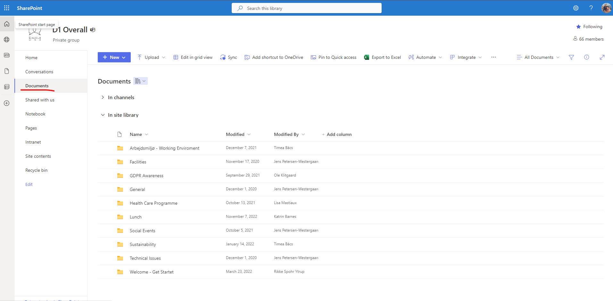
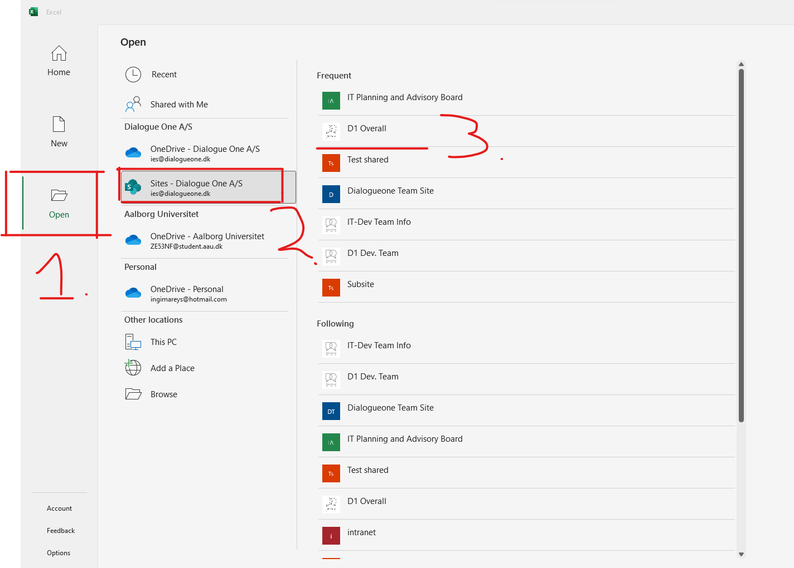

> # Accessing Data

As of May 2023, Dialogue One A/s have decided to move all data to the cloud. This means that all data will be stored in Sharepoint. This is a guide on how to access the data at [https://dialogonedk.sharepoint.com/sites/Testshared](https://dialogonedk.sharepoint.com/sites/Testshared).

## Why are we moving to Sharepoint?

Sharepoint is a cloud based service that allows us to store all our data in one place. This means that we can access the data from anywhere, and we can easily share the data with each other. It also means that we can easily control who has access to the data, and we can easily control who can edit the data. This means that we can ensure that the data is safe and secure. We can also ensure that the data is always up to date.

You may recognize Sharepoint from Microsoft Teams, where it is used to store files within Teams or even when you send a file to someone. This is the same Sharepoint, but we are using it directly instead of through Teams.

### Closing down remote desktop

As we are moving more projects over to Ninox, using Microsoft Access is becoming less and less relevant. This means that we can close down the remote desktops. This will save us money, and it will make it easier to access the data. This is because you can access Sharepoint from any browser, anywhere.

## Accessing Sharepoint

To access Sharepoint, you need to be a member of the Dialogue One A/S organization, you need to go to [https://dialogonedk.sharepoint.com/sites/Testshared](https://dialogonedk.sharepoint.com/sites/Testshared). Here you will be prompted to log in with your Dialogue One A/S account. If you are already logged in, you will be redirected to the home page.

Leveraging Sharepoints many features, we created a homepage that will be used as the main hub for all the data. On this page we imagine a future where you can see new insights and communication from the company. But at the very least, we will ensure that you can always find the data you need safely and easily.

### Accessing the data

#### In the browser

To access the data, you need to go to the folder called `Data`. Here you will find all the data that is stored in Sharepoint. You can also access the data by going to [https://dialogonedk.sharepoint.com/sites/Testshared](https://dialogonedk.sharepoint.com/sites/Testshared).

Similarly to how you would open files through the file explorer, you can open files in Sharepoint. You can also download the files to your computer. This is done by clicking the three dots next to the file and then clicking `Download`. You can also click the file to open it in the browser. Excel files will open in Excel online, and Word files will open in Word online ect.

#### On the Desktop Apps

You can also access the data through the desktop apps. This is done by clicking the `Open>Open in App` button. This will open the file in the corresponding app. This means that Excel files will open in Excel, Word files will open in Word ect.

Another way to open the files in desktop apps is to navigate to the `Open` icon, then selecting `Sites - Dialogue One A/S`, then selecting the `Testshared` site. Here you will find the `Data` folder. You can then navigate to the file you want to open and open it in the corresponding app.

#### In Teams

You can also find the Data in Teams as you most likely have come across already.
