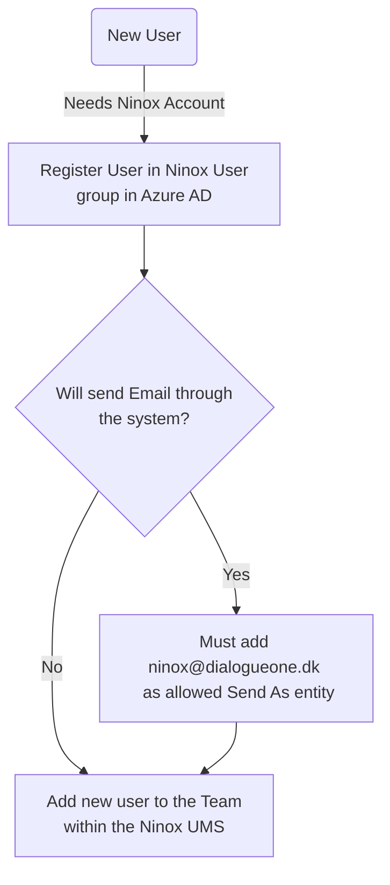

# Add user to Ninox

## Introduction

The process of adding new Consultants to the Ninox SaaS software has been updated to enhance security and efficiency. Previously, users were created manually in Ninox UMS. Now, the process leverages Microsoft SAML2 for Single Sign-On (SSO) and provisions users through Azure AD.

### Objective

This document outlines the new procedure, aiming to streamline user creation and reduce administrative tasks. It ensures that Ninox Admins no longer need to create new users in Ninox UMS manually.

#### Flowchart

The following flowchart visually represents the high-level procedure:

> [!NOTE]
> If the chart below does not load, refresh the page.

### Methodology

#### 1. Registering a New User in Azure AD

**User Group**: The user group in Azure Directory is called `Ninox Users.` New users must be registered here.

**Steps to Register**:

1. Access Azure AD and navigate to the `Ninox Users` group.
2. Click `Add User` and fill in the required details.
3. Confirm and save the new user.

#### 2. Email Configuration (If Applicable)

**Decision Making**: Determine if emails will be sent through the system or not:

- Some teams/projects don't require this feature and send emails semi-manually through Outlook.

**Configuration**:

- If yes, follow the [existing documentation](Product_documentations/ninox/sending_emails.md) to add `ninox@dialogueone.dk` as an allowed `Send As` entity.

#### 3. Adding the New User to the Team within Ninox UMS

**Procedure**:

1. Log in to Ninox UMS.
2. Navigate to the Teams section and to the desired team.
3. Under Team Members, select the new user from the dropdown.
4. Configure the roles and permissions for the new user.
5. Click `Add to team` on the far right.

### Support and Troubleshooting:

- **Service Providers Sotea**: Tel: 70 22 99 24, Email: support@sotea.dk
- **Development Team**: Jens Petersen-Westergaard (jpw@dialogueone.dk), Clara Becker-Jostes (clbj@dialogueone.dk)

#### Glossary

- **Azure AD**: Azure Active Directory
- **Ninox UMS**: Ninox User Management System
- **SAML2**: Security Assertion Markup Language 2
- **SSO**: Single Sign-On
