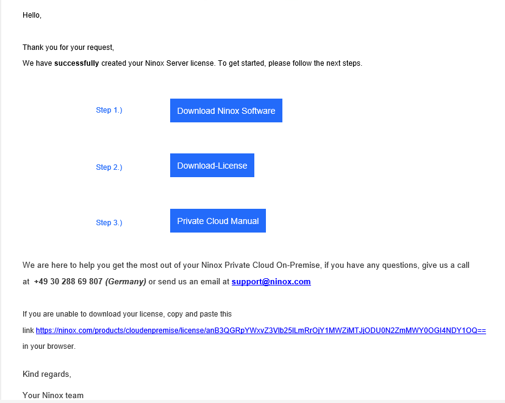
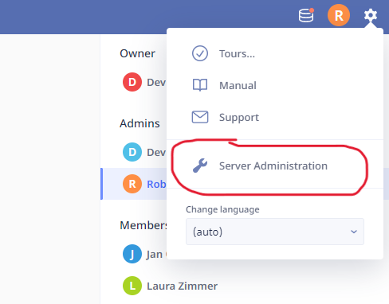
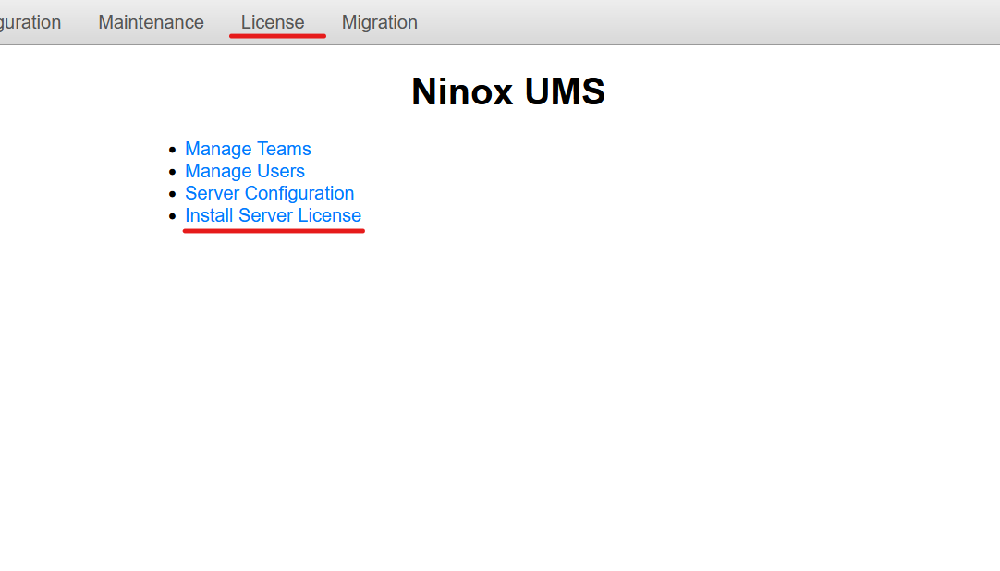

# Updating Ninox Licenses

This documentation shows how to update the Ninox license.

## Prerequisites

- You need to have access to the server administration in Ninox.
- You need to have the email with the new Ninox license file.

## Procedure

1. **Start by opening the email containing the new license.**

   - Follow the steps described in the email to download the license file.

     

2. **Navigate to Server Administration in Ninox**

   

3. **Select "Install Server License" or "License"**

4. **Upload License File** Scroll down to the "Upload License File" section, select the license file and click "Upload and Restart".

5. **License Validation** Check if the "License valid until" field is now updated.

> [!TIP]
> If you encounter any issues during this process, please contact the IT team or Ninox at support@ninox.com.
