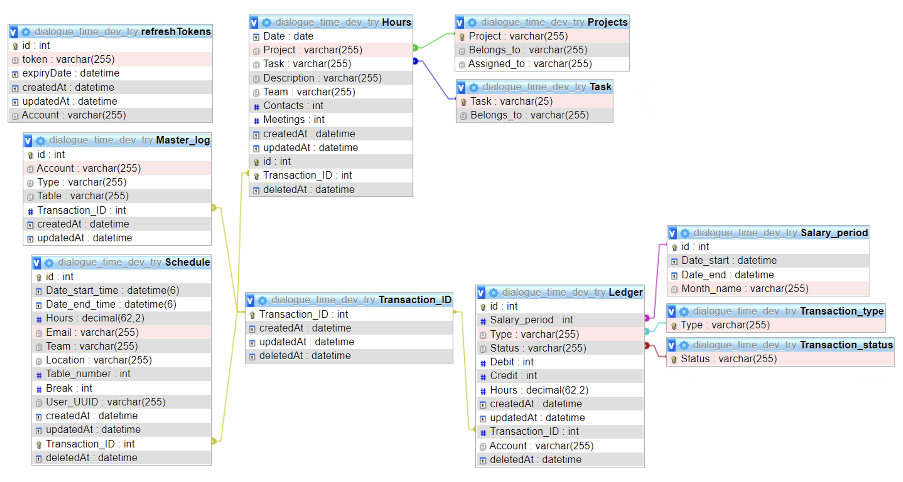
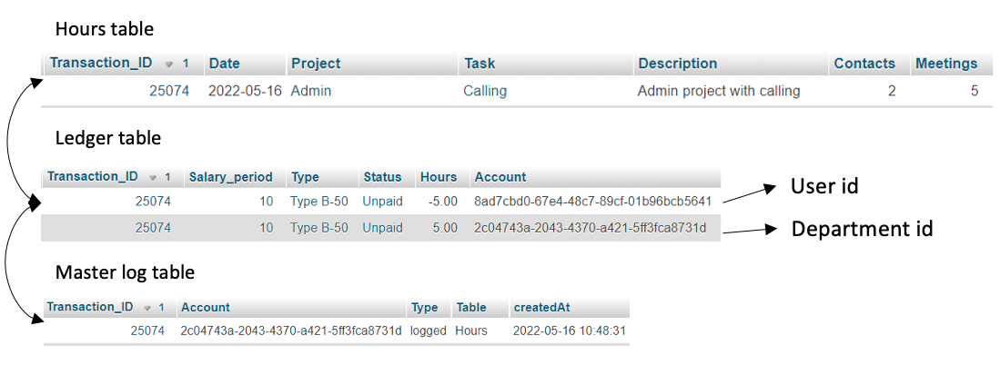

> # Databases

Dialogue Time uses a MySQL database as its primary database. Currently, the database is running on a MySQL server on the VM, as containerization work has not yet been done. To administer the database, I am running phpMyAdmin, which provides a GUI for managing the database.

## MySQL

### Relationships

During the database redesign phase, the focus was on how the data related to each other, resulting in a design mainly centralized around one table. This table is the Transaction ID table, which serves as a reference to all transactions in the Hours, Ledger, and Schedule tables, containing a reference to all user inputs. This design allowed for the creation of a Master log table quite quickly.

Furthermore, Sequalize models can be extended with predefined methods, such as beforedelete() and afterdelete(), which are called Hooks and function as triggers or middleware. Each of the Seqalize Hooks has different states depending on the execution order, and they can receive various options or accept data from the action itself. Since the user is known by reading their authentication token on each API request, the master log can capture the MS user ID along with the transaction ID and type of CRUD operation.




### Transactions Data

The database redesign focused on implementing a double transactional ledger, which resulted in two separate tables: an hours metadata table and a ledger table. When an entry is logged in the database, a metadata row and two ledger rows are created, and the transaction ID serves as a link between them. This approach created a clear separation of concerns, where one table is dedicated to user payroll and the other to project management. By splitting the tables, we achieved a more organized and efficient database structure.




### Ledger table

The database design includes a ledger table and an hours metadata table, which are related through a transaction ID. The ledger table has two rows for each entry, with one representing the user or department and the other representing the project. In case of deferring hours from one salary period to another, the same user ID is added to both rows, and other columns define the period in which the hours are detracted and added. No metadata row is created for this action as it is only related to payroll.

The salary period column in the ledger table is related to the salary period table, where periods are defined. This column serves as a parameter for exporting the logged ledgers for specific salary periods. The type column defines the type of hour logged, which influences the hourly rate, and the status column indicates whether the logged hours are paid out, unpaid, or pending approval.

### Hours table

The hours’ metadata table is used for project management purposes where the projects, the application logs tasks and other key performance indicators (KPIs) to track the progress of each project. The ledger table contains information about the logged hours, and by joining this table with the metadata table using the Transaction ID, a clear picture of the project status can be obtained. The relationship between the tables is transactional, meaning that a relation between logged hours and differed hours will never exist.

Figure 4.18 depicts the transactional data diagram between the logged hours, ledger, and master log tables. It should be noted that the arrows representing user id and department id are mixed up in the graphical representation.

### Sequalize

Sequalize Sequelize is a modern TypeScript and Node.js ORM for Postgres, MySQL, MariaDB, SQLite and SQL
Server, and more. Featuring solid transaction support, relations, eager and lazy loading, read replication
and more. Read more..

## MongoDB

MongoDB was chosen as the database for storing announcements due to its document-based structure, which makes it easy to create models for the data. The announcement model is built using JSON objects with nested arrays, with the highest level containing important information such as the message title, content, sender, and group IDs. The lower levels of the object contain an array of user IDs who have marked the message as read. This approach allows for efficient tracking of read messages and helps to ensure that users receive only the most relevant information.

### Mongoose

Mongoose is a powerful Object Data Modeling (ODM) library for MongoDB and Node.js, which allows developers to create and interact with MongoDB databases in an object-oriented manner. It shares some similarities with Object-Relational Mapping (ORM) libraries like Sequalize, but it also has its unique features and syntax.

Mongoose provides a simple yet flexible schema-based solution to model application data, allowing developers to define data types, validation rules, and relationships between documents in a clear and concise way. The structure of Mongoose models and queries are different from those of Sequalize, but it still provides a similar separation of concern and modularity that enables developers to write clean, maintainable, and scalable code.

### Models

#### Notifications

Mongoose will use Models like explained above, there are currently two files that define the Mongoose schemas. For the HR notifications and public notifications. They create a Mongoose model for the schemas. The schema contains various fields such as the sender, recipient group, and content of the notification, as well as a list of people who have read the notification. The model is used to interact with the MongoDB database and perform operations such as creating, reading, updating, and deleting HR notifications.

> These models are used in tandem with the websockets which you can read in the next section.

`/var/www/html/apiV2/websockets/models/hr.js`

```js
// Importing the Schema and model classes from the Mongoose library
import { Schema, model as _model } from "mongoose";

// Defining a new Mongoose schema for HR notifications
const Hr_notifications = new Schema(
  {
    Intent: { type: String, required: true }, // The type of notification
    Sender: { type: String, required: true }, // The name of the sender
    SenderId: { type: String, required: true }, // The unique identifier of the sender
    Title: { type: String, required: true }, // The title of the notification
    Message: { type: String, required: true }, // The content of the notification
    Group: { type: Schema.Types.Mixed, required: true }, // The group of recipients for the notification
    Date: { type: Date, default: Date.now }, // The date the notification was created
    People_read: [
      // The list of people who have read the notification
      {
        user_uuid: { type: String, required: true },
        date_read: { type: Date, default: Date.now },
      },
    ],
  },
  { collection: "Hr_notifications" } // The name of the MongoDB collection
);

// Creating a Mongoose model for HR notifications using the schema
const model = _model("Hr_notifications", Hr_notifications);

// Exporting the Mongoose model for HR notifications
export default model;
```
