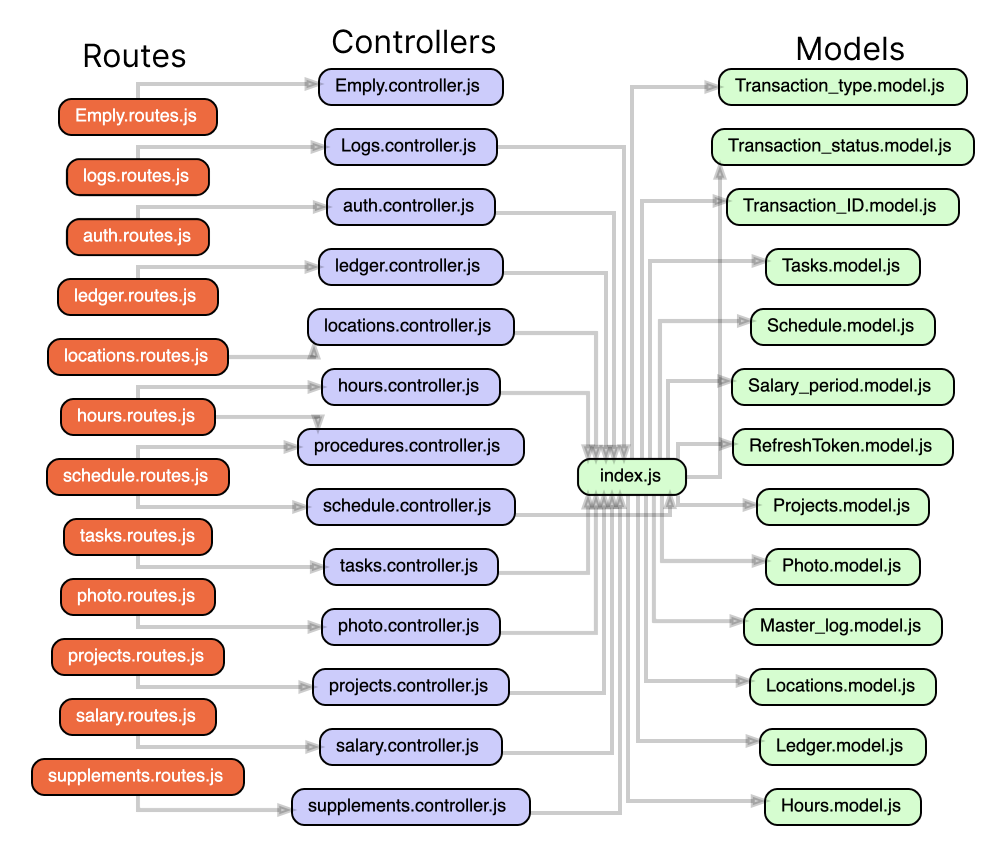

> # Node JS

## Index file

The index file is responsible for setting up an Express server with various middleware and routes defined in separate files, connecting to a MongoDB database, and starting a websockets server. The Swagger UI is also used to serve API documentation. A startup function is called first to handle process events and return a Promise, and the dotenv module is used to load environment variables from a .env file.

```js
// Import necessary modules and files
import express from "express";
import websockets from "./websockets/index";
import startup from "./lib/startup";
import logger from "./lib/logger";
import middleware from "./middleware/index";
import mongoose from "mongoose";
import swaggerUi from "swagger-ui-express";
import swaggerFile from "./swagger_output.json";
import { VerifyToken } from "./middleware/authJwt.js";
require("dotenv").config();

// Call startup function which handles process events and returns a Promise
startup()
  .then(() => {
    // Create a new instance of Express app
    const app = express();

    // Use Swagger UI to serve the Swagger API documentation
    app.use("/doc", swaggerUi.serve, swaggerUi.setup(swaggerFile));

     // Use rate limiting middleware to prevent abuse
     app.use(
       rateLimit({
         windowMs: 12 * 60 * 60 * 1000, // 12 hour duration in milliseconds
         max: 5,
         message: "You exceeded 100 requests in 12 hour limit!",
         headers: true,
       })
     );

    // Use middleware to handle various tasks
    middleware(app);

    // Use the routes defined in separate files
    require("./app/routes/auth.routes.js")(app);
    require("./app/routes/schedule.routes")(app, VerifyToken);
    require("./app/routes/Preference.routes")(app, VerifyToken);
    require("./app/routes/hours.routes")(app, VerifyToken);
    require("./app/routes/tasks.routes")(app, VerifyToken);
    require("./app/routes/supplements.routes")(app, VerifyToken);
    require("./app/routes/projects.routes")(app, VerifyToken);
    require("./app/routes/locations.routes")(app, VerifyToken);
    require("./app/routes/Emply.routes.js")(app, VerifyToken);
    require("./app/routes/salary.routes.js")(app, VerifyToken);
    require("./app/routes/ledger.routes.js")(app, VerifyToken);
    require("./app/routes/photo.routes.js")(app, VerifyToken);
    require("./app/routes/logs.routes.js")(app, VerifyToken);
    require("./app/routes/teams.routes.js")(app, VerifyToken);

    // Set the port number and listen for incoming requests
    const PORT = process.env.PORT || 8083;
    const server = app.listen(PORT, () => {
      if (process.send) {
        console.log(`Server running at http://localhost:${PORT}\n\n`);
        process.send(`Server running at http://localhost:${PORT}\n\n`);
      }
    });

    // Connect to MongoDB and start the websockets server
    mongoose
      .connect("mongodb://localhost:27017/websockets", {
        useNewUrlParser: true,
        useUnifiedTopology: true,
      })
      .then(() => websockets(server))
      .catch((err) => console.log(err));
  })
  .catch((error) => {
    logger.error(error);
  });
```

The following Diagram shows the flow of the index file.




## Settings

The settings file reads the contents of a JSON file called settings-${process.env.APP_SETTINGS}.json and parses it into a JavaScript object, which is then exported as the default export of this module.

The process.env.APP_SETTINGS variable is used to determine the name of the file to read, and its value is obtained from an environment variable defined in a .env file, which is loaded using the dotenv package.

`/var/www/html/apiV2/lib/settings.js`

```js
import fs from "fs";
require("dotenv").config();

export default JSON.parse(
  fs.readFileSync(`settings-${process.env.APP_SETTINGS}.json`, "utf-8") || "{}"
);
```

If the file does not exist or is empty, an empty object is returned instead. The fs.readFileSync method is used to read the contents of the file synchronously, and the JSON.parse method is used to parse the contents into a JavaScript object.

## Startup

The startup file defines functions for handling process events such as exit, uncaught exceptions, and unhandled rejections. The handleProcessEvents function defines handlers for these events, including closing the MongoDB connection on process exit and logging errors and warnings for uncaught exceptions and unhandled rejections.

`/var/www/html/apiV2/lib/startup.js`

```js
/* eslint-disable consistent-return */

import logger from "./logger";

// Defines functions for handling process events such as exit, uncaught exceptions and unhandled rejections
const handleProcessEvents = () => {
  try {
    // Handles closing the MongoDB connection on process exit
    process.on("exit", async () => {
      if (
        process.mongodb &&
        process.mongodb.connection &&
        process.mongodb.connection.isConnected()
      ) {
        process.mongodb.connection.close();
      }
    });

    // Handles uncaught exceptions by logging them as errors and warnings
    process.on("uncaughtException", (error) => {
      logger.error(error);
      console.warn(error);
    });

    // Handles uncaught exceptions by logging them as errors and warnings
    process.on("uncaughtException", async (error) => {
      logger.error(error);
      console.warn(error);
    });

    // Handles unhandled rejections by logging them as errors and warnings
    process.on("unhandledRejection", async (error) => {
      logger.error(error);
      console.warn(error);
    });
  } catch (exception) {
    throw new Error(
      `[startup.handleProcessEvents] ${exception.message || exception}`
    );
  }
};

// Defines the startup function which handles the process events and resolves or rejects a Promise
const startup = async (options, { resolve, reject }) => {
  try {
    handleProcessEvents();
    resolve();
  } catch (exception) {
    reject(`[startup] ${exception.message}`);
  }
};

// Exports a Promise which resolves or rejects when the startup function is called
export default (options) =>
  new Promise((resolve, reject) => {
    startup(options, { resolve, reject });
  });
```

1. handleProcessEvents() function is defined, which includes the following event handlers:

- "exit": This handler is used to close the MongoDB connection when the Node.js process is exited.
- "uncaughtException": This handler is used to log any uncaught exceptions as errors and warnings.
- "unhandledRejection": This handler is used to log any unhandled rejections as errors and warnings.

2. startup() function is defined, which calls the handleProcessEvents() function and then resolves or rejects a promise based on whether or not any exceptions occurred.

3. The entire file exports a promise that resolves or rejects when the startup() function is called. This code is typically called when the Node.js server is started and sets up event handlers to ensure the server shuts down correctly and any errors are properly logged.
