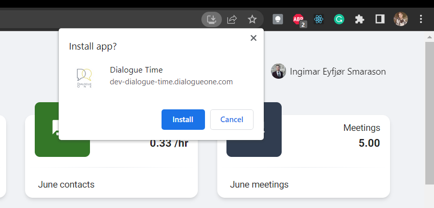

> # Progressive Web Apps (PWA)

The application was designed with a core goal of being future-proof by utilizing the latest technologies and methods. One such technology is Progressive Web Apps (PWA), which allows for the development of an app that resembles native applications written in platform-specific programming languages. This makes the application cross-platform using web technologies only, eliminating the need to develop the app multiple times with different environmental requirements.

PWAs are web apps enhanced with modern APIs to deliver enhanced capabilities, reliability, and installability while reaching anyone, anywhere, on any device, all with a single codebase. They provide a hybrid of a website and a native app experience while still being indexed on search engines, increasing engagement. As a relatively new field, more features are being developed that bring PWAs closer to a native app experience.



## Service workers

Creating a service worker script using JavaScript is a necessary step in building a PWA. This script is loaded on the index page and registered when the client first reads it. The service worker then acts as a network proxy between the browser client and the server, deciding whether to fetch resources from the server or serve them from the browser's cache if available. Service workers are a fundamental component of a PWA, providing fast loading, offline access, push notifications, and other capabilities.

### Configuring Service workers

Progressive Web Apps (PWA) are designed to be reliable and work even when offline. While this feature may have limited use in Dialogue Time since the app primarily delivers and accepts data from users, service workers can be configured to enable offline functionality. The Cache Storage API can be used to download, store, delete, or update assets on the device, allowing the app to serve these assets without needing a network request.

```js
// File: should be in index, but my index.html file has different configurations
if ("serviceWorker" in navigator) {
  navigator.serviceWorker.register("/serviceworker.js");
}
```

A simple example on how to register a service worker.

### Caching policy

The policy I set for the service workers was to load static files first. These files are images, CSS and JavaScript
files. This makes the initial loading time faster than the client requesting the resources from the server.

```js
// File: public/service-worker.js
workbox.routing.registerRoute(
  ({ request }) =>
    request.destination === "image" ||
    request.destination === "script" ||
    request.destination === "style",
  new workbox.strategies.CacheFirst()
);
```

A simple example on how to register a service worker.

“You can use the Cache Storage API to download, store, delete or update assets on the device. Then these assets
can be served on the device without needing a network request”.

## Request user to update

By configuring service workers, it is possible to notify users of new application versions. In Dialogue Time's case, the service workers are set up to check the cached version number and compare it to the version number on the server. If a difference is detected, the service worker will prompt the user to update the application. The service worker can be easily re-registered by dumping the cache and reloading the page, due to the fact that it is written in JavaScript code.


### Web app manifest

To improve the look and feel and basic behavior of the PWA, a web app manifest is created. This file is a JSON file that defines how the PWA should be treated as an installed application. It includes information such as the name of the app, a short name, the icon, the theme color, and other advanced options. By creating a web app manifest, developers can improve the user experience by providing users with a more native-like application feel.

