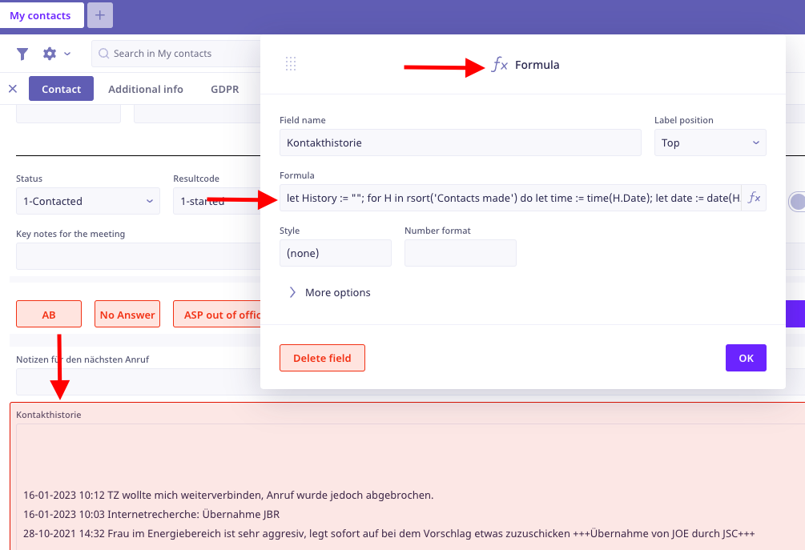

> # Contact history

## Description

The contact history in the Address view is a list of all the contacts that has been made with the contact. The list is sorted by the date of the contact, with the newest contact at the top. **However**, in some cases the contact history from `Access` database is sorted in the opposite way, with the newest contact at the bottom. Since the history from `Access` is a text field, it was decided not to spend to much time on splitting the text to sort it in the same way as the history in `Ninox` (this could be done in the future).

> [!TIP]
> **Type of element**<br>The element for the contact history is a `Formula` field, which means that you can make various different calculations and operations on the field. Read more about it here [Formula](https://docs.ninox.com/en/tutorial/intermediate#working-with-formulas).



## Code Documentation

The code below shows how Ninox sorts the contact history.

1. Set the variable `History` to an empty string.
2. For each contact in the `Contacts` table, do the following:
   1. Set the variable `time` to the time of the contact.
   2. Set the variable `date` to the date of the contact.
   3. Set the variable `History` to the current value of `History` plus the date, time and description of the contact.
3. `Calling` the variable `History` plus the old description of the contact (`Access` history) at the end of the code block will make Ninox display the text in the `View`.

```javascript
let History := "";
for H in rsort('Contacts made') do
 let time := time(H.Date);
 let date := date(H.Date);
 History := text(History + "
" + format(date, "DD-MM-YYYY") + " " + time + " " + H.Description)
end;
History + "
" + 'Old description'
```