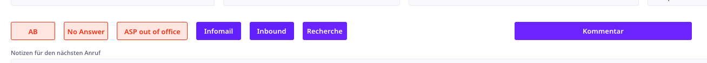

> # Contact buttons

There are various buttons that produce a new contact for an address in the address View. The main differences between the buttons are the fields that are prefilled in the new contact record. For example:



- The red AB, No Answer, and ASP out of office buttons will create a new contact, and set the next contact date to the next day. Since these buttons are used when the contact is not available.
- The Infomail, Inbound and Recherche buttons does the same, but sets the last contact field to today. Since these buttons are used when the contact was available and information was sent to them. Then the new contact view pops up, and it's up to the consultants to choose the next contact date based on the agreement with the contact.
- The Kommentar button creates a new contact for the address, it sets the new last contacted date to today, but doesn't fill in any specific information, this is used when the consultant wants to manually write a comment about the contact.

## Code documentation


### Kommentar button

> Following code is for the `Kommentar` button, but the other buttons are similar.

```javascript
// Set the current record's ID to the variable myID
let myID := Id;

// Create a new record in the Contacts table
let D := (create Contacts);

// Set the various fields in the new contacts record
D.(Adressen := myID);
'Letzter Kontakt' := now();
D.(User := userId());
User := user();

// Open the new contact record in a popup
popupRecord(record(Contacts,D.Id))
```

### Infomail button

> Following code is for the `Infomail` button, but the other buttons are similar.

```javascript
// Set the current record's ID to the variable myID
let myID := Id;

// Create a new record in the Contacts table
let D := (create Contacts);
D.(Adressen := myID);
User := user();
'Letzter Kontakt' := now();
D.(User := userId());
D.(Description := "Informatiosmail versendet");

// Open the new contact record in a popup
popupRecord(record(Contacts,D.Id))
```

### No Contact button

> Following code is for the `ASP - out of office` button, but the other buttons are similar.

```javascript
// Set the current record's ID to the variable myID
let myID := Id;
// Create a new record in the Contacts table
let D := (create Contacts);
// Set the various fields in the new contacts record
User := user();
D.(Description := "ASP - out of office");
'Letzter Kontakt' := now();
'Nächster Kontakt' := date(now()) + 1;
D.(Adressen := myID);
D.(User := userId());
// Open the new contact record in a popup
popupRecord(record(Contacts,D.Id))
```
