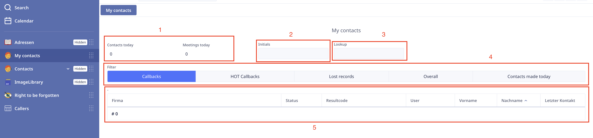
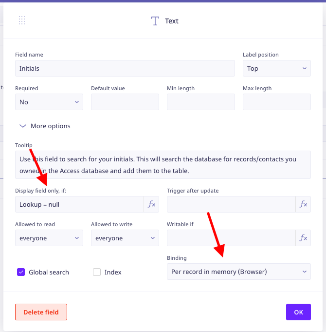
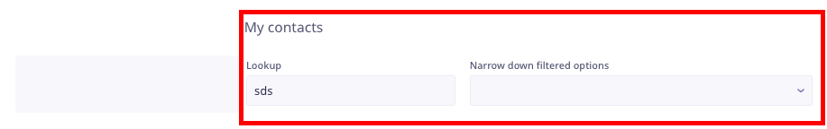
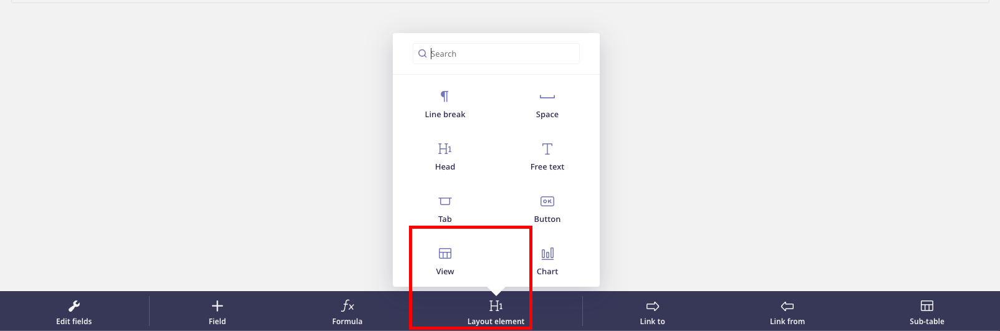
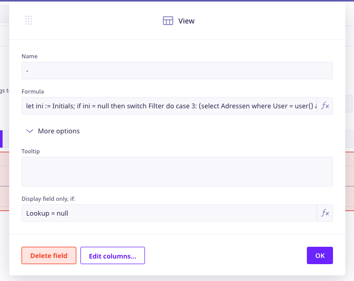

> # Filters

Filters are used to filter the records of a table. In our databases we have made some custom filters. Like the ones the consultants use in the `My contacts` view.

In the my contacts view there are several elements that are used together to provide a list of callbacks and other relevant records that consultants need to follow up on. In order of appearance, I will document the entire code and functionality of the view.

**The components in this view are:**

1. Contacts and meetings made today
    - Although it's not filtering in records, these elements show the number of contacts and meetings made today.
2. Initials:
    - This text field is used to search and filter in records by the consultants initials.
    - This field is extremely important when considering the data from `Access` database, where the initials are used to identify the consultant, this field ensures the continuity between the two databases.
3. Lookup:
    - This field is used to lookup specific records by for example, the name of the company, name of the contact, Dialogue ID ect.
    - It has a component dropdown field that appears when the field is used, which allows the consultants to narrow down the search results by specific fields they are interested in.
4. Type of contact buttons:
    - These buttons are used to filter out specific types of contacts, for example, callbacks, HOT callbacks, Lost records ect.
    - They use various fields like last contact date, next contact date, HOT ect.
5. The View:
    - The view takes on a table format which shows the filtered out records.
    - The main code and functionality is in the view, which is explained in the next section.



> [!TIP]
> There are 3 views in `My Contacts` view, firstly, the view itself (the page where the elements lay). The records view (5) as seen in the image, is also called a view. Then there's another hidden view (6), which is the same as (5), but uses the Lookup field (3) to filter out records.

## Contacts and meetings made today

This element is used to show the number of contacts and meetings made today. You can find the code by clicking on the tool icon and selecting the element, then in the formula bar you'll see the following code:

1. `cnt()` function which counts the number of records.
2. `selct Contacts where User = user() and date(Date) = today()` which selects the records where the user is the current user and the date is today.

```javascript
cnt(select Contacts where User = user() and date(Date) = today())
```

Similarly the meetings made today element uses the following code:

```javascript
cnt(select Meetings where User = user() and date(Date_created) = today())
```

## Initials

The initials is simply a `Text` field where users can input their initials. There's no code behind this field, but it does have specific properties that are important to note.



1. The `Initials` field is a `Text` field.
2. When editing the field you can see the Display field only, if: Lookup = null.
    - This means that if the Lookup is empty then display the initials field, otherwise hide it.
3. Binding is set to Per record in memory (Browser)
    - The binding means that you can change this field and it will only be changed for the user.
    - The binding is usually set to `Server` which means that if this field is changed, everyone will see the change (and then filter out the records for everyone using Ninox).

> [!NOTE]
> Please note the specific properties of the `Initials` as explained right above.

## Lookup

The same foes for the lookup, there's no code behind this field. However once filled, the `Initials` and `Type of contact buttons` fields are hidden as explained above.



If the lookup is filled in then the `Narrow down filter options` dropdown field is displayed **(`Choice` field displayed as combo box)**, which follows the same principals as we just covered in the `Initials` field.

The `Narrow down filter options` dropdown field is a `Choice` field with the following choices:


## Type of contact buttons

The type of contact buttons is a `Choice` field displayed as a `Switch`, these choices are used to filter out specific types of contacts, for example, callbacks, HOT callbacks, Lost records ect. They use various fields like last contact date, next contact date, HOT ect. There's nothing specific about these fields, they are designed similarly to the previously explained elements, and the choices here are used in the next section where the code for the filtering is explained.

> These fields mentioned above, must be bound by the `Per record in memory (Browser)` binding, otherwise the consultants will see each others initials and lookup fields and filters.

## The View

The records displayed when in the `My contacts` view are in itself a `View` field, which takes on different properties depending on the type of data it is displaying. In this case, the view is displaying records from the `Address` table.



To change the code in the view simply activate the tool icon and select the view field, 



### Code documentation

#### The default view (5)

The code for the view can be split in two parts, the code is executed when the view is loaded, but also is aware if the Intials field is changed, or the Type of contact buttons are changed. The code is as follows:

It starts by retrieving the `Initials`, if it's empty then it uses the current user with the `user()` function. Then it uses the `switch` function, which uses the values from the `Filter` buttons **(4)**, to filter out the records depending on the choice selected.

The second part is doing the same thing, but rather then using the `user()` it uses the `Initials` for the filtering.

```javascript
// Retrieve the Initials from the Initials field
let ini := Initials;

// If the Initials field is empty then use the current user()
if ini = null then
 switch Filter do
 // If the Filter is 3 (3 is ID from the choice field) then use the following code
 case 3:
  (select Adressen where User = user() and 'HOT/' = true and 'Nächster Kontakt' != null and 'Nächster Kontakt' <= today() and not Status = 6 and not Resultcode = 14)
 case 1:
  (select Adressen where 'Nächster Kontakt' <= today() and User = user() and 'Nächster Kontakt' != null and not Status = 6 and not Resultcode = 14)
 case 9:
  (select Adressen where days('Nächster Kontakt', today()) > 10 and not Status = 6 and not Resultcode = 14)
 case 10:
  (select Adressen where User = user() and date('Letzter Kontakt') = today() and not Status = 6 and not Resultcode = 14)
 case 7:
  (select Adressen)
 default:
  (select Adressen where User = user() and 'Nächster Kontakt' != null)
 end

// If the Initials field is not empty then use the Initials field
else
 switch Filter do
 case 3:
  (select Adressen where (User = user() or Caller = ini) and 'HOT/' = true and 'Nächster Kontakt' != null and 'Nächster Kontakt' <= today() and not Status = 6 and not Resultcode = 14)
 case 1:
  (select Adressen where 'Nächster Kontakt' <= today() and (User = user() or Caller = ini) and 'Nächster Kontakt' != null and not Status = 6 and not Resultcode = 14)
 case 9:
  (select Adressen where days('Nächster Kontakt', today()) > 10 and not Status = 6 and not Resultcode = 14)
 case 7:
  (select Adressen)
 case 10:
  (select Adressen where (User = user() or Caller = ini) and date('Letzter Kontakt') = today() and not Status = 6 and not Resultcode = 14)
 default:
  (select Adressen where 'Nächster Kontakt' != null or (User = user() or Caller = ini))
 end
end
```

#### The view when the lookup is filled in (6)

This is the code for the view once the `Lookup` field is filled out. It's very similar to the code above, but it uses the `Lookup` field instead of the `Initials` field. One noticeable difference is that this function only has one switch statement, and uses the `like` operator to filter out the records.

The like operator is used to filter out records that contain the value of the `Lookup` field, for example, if the `Lookup` field contains the value `John` then the records that contain the value `John` in any of the fields will be displayed for example First name = John Smith.

```javascript
let ini := Lookup;
if ini != null then
 switch 'Narrow down filtered options' do
 case 1:
  (select Adressen where Durchwahl like ini or Phone like ini)
 case 2:
  (select Adressen where Ort like ini)
 case 3:
  (select Adressen where Vorname like ini)
 case 4:
  (select Adressen where 'Dialogue id' = ini)
 case 5:
  (select Adressen where Firma like ini)
 case 6:
  (select Adressen where Postleitzahl like ini)
 default:
  (select Adressen where Caller like ini or Id like ini or 'Dialogue id' like ini or Durchwahl like ini or Phone like ini or Segment like ini or 'Caller Name' like ini or User like ini or Email like ini or Vorname like ini or Nachname like ini or Firma like ini or 'Straße' like ini or SQLDatum_gesendet like ini or Status like ini or Hausnummer like ini or Ort like ini)
 end
end
```