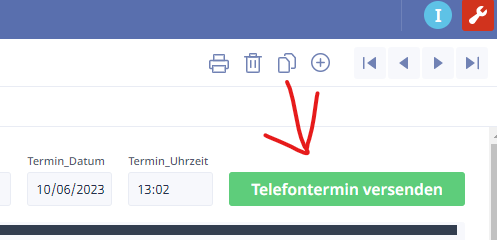
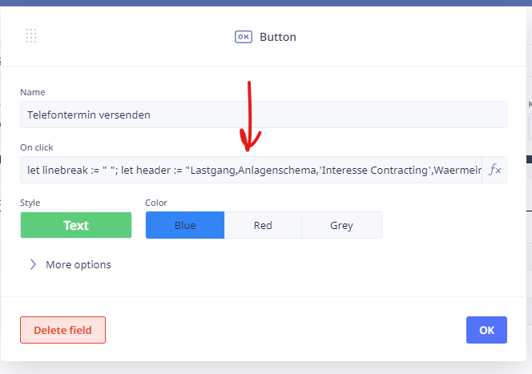

> # Meeting button

This section describes the code used to automate the email generation process when clicking on the "Book Meeting" button.

## Description

The "Book Meeting" button is used to automate the process of creating a new contact record, a new meeting record, and generating an email to send to our client. There are two ways we do this in Ninox, one is by sending the email directly from Ninox, and the other is by opening the default email client with a pre-filled email ready to send.

The first method is using our own Email servers as the client does not mind receiving emails from our servers. The second method is used when the client does not want to receive emails from our servers, and instead wants to receive emails from their own email servers.

## 1st Example: Sending emails directly from Ninox

> [!Note]
> In the [Sending emails](Product_documentations/ninox/sending_emails.md) setup documentation you can find more information about how to setup the email server in Ninox.

An email may need to be sent to our client informing them of the new Lead and booked meeting, as well as to the sales rep who booked the meeting. This can be done using the `sendEmail` function in Ninox.



The following code does the following:

1. Creates a new contact record and a new meeting record, and sets various fields in the records.
2. Generates an CSV document containing various data fields that our clients want, and stores the document to the Contact record.
3. Generates a string containing the history of contacts made with the contact, and stores it in the `History` variable.
4. Composes an email using the `sendEmail` function, sending the email to the client on behalf of the consultant who booked the meeting. The email includes various data fields and their corresponding values, forming the email content and all files attached to the Contact record.

### Creating the CSV file



The first part of the code defines the columns for the CSV file, the final linebreak is used to separate the header from the data.

```js
let linebreak := "
";
let header := "`Column 1`, `Column 2`, ... more columns ..." + linebreak;
```

The next part of the code tells Ninox to create a temporary file with the header names

```js
URL := do as server
		createTempFile(header, "export.csv")
	end;
```

The next part of the code defines the data for the CSV file, seeing as we only need one row for the data there's no need to create a loop.

```js
let line := "`Data 1`, `Data 2`, ... more data ..."
```

> [!Note]
> The column headers and data values are examples, the `Data 1` in the previous example would be a Ninox field in the view that's meant to be filled out by the user. Whilst the `Column 1` would be the name of the field in the CSV file.

The next part tells Ninox to append the data to the CSV file and then to import it to the contact record.

```js
do as server
	appendTempFile(URL, line)
end;
importFile(this, URL, "Qualifiers.csv");
```

### Generating the email content

The next part of the code generates the email content, this is done by creating a string and then adding the various data fields to the string. The string is an HTML markup language, this allows us to format the email content in any way we want.

```js
// Define the text variable
let text := "<p>Hello this is called a paragraph HTML tag</p>";

// Add more fields to the text variable
text := text + "<p>More text</p>";

// Add specific form field content to the text
text := text + "<p>" + text(Firstname) + "</p>";

// Loop through all contact history and make a list
let History := for H in 'Contacts made' do
		H.Date + " " + H.Description + "<br>"
end;

// Add old contact history to new contact history
let OlddescriptionURL := 'Old description';
```

### Sending the email

Now putting it all together, we can use Ninox to send an email on our behalf, however please be aware the this requires proper access rights, so please check the [Sending emails](Product_documentations/ninox/sending_emails.md) documentation for more information.

```js
// Define the message as the text
let message := text;
// Define Title for the Dialog
let title := "Review email";
// Define the answer options for the Dialog
let answerOptions := ["Yes, send email", "No! don't send"];
// If the user clicks on "Yes, send email" then send the email
if dialog(title, message, answerOptions) = "Yes, send email" then
// Send the email with the sendEmail function and following parameters
	sendEmail({
		from: "{User email address}",
		to: "{Client email address}",
		subject: "Terminvereinbarung: " + Firma1,
		text: "We received your request to get another copy of your invoice",
		html: text,
      // The below line attaches all the files from the contact record
		attachments: files(this)
	})
end
```

> [!TIP]
> The code here uses html markup language, rather than formatting the content into a URL string as you will read more about in the next section.

## 2nd Example: Opening the default email client with a pre-filled email ready to send


### When should it be changed?

It's important to know what to do when the button needs to be changed. The button should be changed when the email template changes, or when the meeting template changes. The button should also be changed if the recipients of the email changes, or if you are using the database as a template to create a new one.

For example:

- Fields in the view change (new fields added or removed).
- The email template changes.
- The meeting template changes (based on our clients' needs).
- The recipients of the email changes (based on our clients' needs).
- The database is used as a template to create a new one.

## Code

To open the script editor, click on the button with the settings icon enabled, click on the `On click` formula bar to open the script editor.


Then you should see something like this:


## Breakdown

The script could be broken down into three parts:

1. Creates a new contact record and a new meeting record, and sets various fields in the records.
2. Generates a string containing the history of contacts made with the contact, and stores it in the `History` variable. Along with collecting various data fields and storing them in URL-encoded variables.
3. Composes a browser based email link using `mailto:`, and using the `openURL` function to open the default email client with pre-filled recipient, subject and body.

> At the bottom of this section, you can find how to format URL encoded text for `mailto:` links.

## The script involves the following steps:

1. Variables `myID`, `D`, and `M` are declared and assigned values. The `myID` get's the `Id` field from the current record, `D` creates a new record in the `Contacts` table, and `M` creates a new record in the `Meetings`. (`D` and `M` now store the newly created records as variables and can be used to access or modify the records)
2. The `Description` field of the `D` (Contacts) record is set to "Meeting booked".
3. The field `Letzter Kontakt` is set to the current date and time.
4. The field `SQLDatum_gesendet` is also set to the current date and time.
5. The `Adressen` field of the `D` record is set to `myID`, (this connects the newly made contact to the current Address record)
6. The `User` field of `D`, `M`, and a global variable `User` is set to the current user's ID.
7. The `Company` field of `M` is set to `myID` (this connects the meeting to the address book).
8. The `Contacts` field of `M` is set to the ID of `D` (this connects the meeting to the contact).
9. A loop is performed on records in the table `'Contacts made'`, generating a string concatenating the date, URL-encoded description, and line break (`%0A`) for each record. The resulting string is stored in the `History` variable.
10. Several variables are assigned URL-encoded values based on various data fields.
11. The `Nächster Kontakt` field is cleared (set to an empty string).
12. An email is composed using the `openURL` function, opening the default email client with pre-filled recipient (in the example below you can find the `{{add recipent here}}`), carbon copy recipients (`{{add cc recipent here}}`), subject (`Termin%20vereinbart` URL-encoded value of "Termin vereinbart"), and body. The body includes various URL-encoded fields and their corresponding values, forming the email content.

```javascript
// Get the current record's ID
let myID := Id;

// Create a new records in the Contacts and meetings tables
let D := (create Contacts);
let M := (create Meetings);

// Set the various fields in the new contacts and meeting records
D.(Description := "Meeting booked");
'Letzter Kontakt' := now();
SQLDatum_gesendet := now();
'Nächster Kontakt' := "";
D.(Adressen := myID);
D.(User := userId());
User := user();
M.(User := userId());
M.(Company := myID);
M.(Contacts := D.Id);

// Create a string containing the history of contacts made with the contact
let History := for H in 'Contacts made' do
    H.Date + " " + urlEncode(H.Description) + "%0A"
end;

// Collect all the information needed for the email, and store them in URL-encoded variables
let Termin_DatumURL := urlEncode(text(Termin_Datum));
let Termin_UhrzeitURL := urlEncode(text(Termin_Uhrzeit));
let KundenmanagerURL := urlEncode('Kundenmanager (VV)');
let CompanyURL := urlEncode(Firma);
let PostleitzahlURL := urlEncode(Postleitzahl);
let OrtURL := urlEncode(Ort);
let StatusURL := urlEncode(text(Status));
let ResultcodeURL := urlEncode(text(Resultcode));
let SalutationURL := urlEncode(text(Anrede));
let FirstnameURL := urlEncode(Vorname);
let LastnameURL := urlEncode(Nachname);
let PositionURL := urlEncode(Position);
let MobilURL := urlEncode(Durchwahl);
let EmailURL := urlEncode(Email);
let HauptinteresseURL := urlEncode('Key notes for the meeting');
let UserURL := urlEncode(userFullName());
let OlddescriptionURL := urlEncode(raw('Old description'));

// Open the default email client with pre-filled recipient, subject and body
openURL("mailto:" + "{{add recipent here}}" + "?" + "cc=" + "{{add cc recipent here}};{{add cc recipent here}};{{add cc recipent here}}" + "&subject=" + "Termin%20vereinbart" + "&" + "body=" + "Termin%20Datum:%20" + Termin_DatumURL + " um:%20" + Termin_UhrzeitURL + " %0A" + "Key Account Manager:%20" + "Jonas Witt" + "%0A%0AFirma:%20" + CompanyURL + "%0AStadt:%20" + PostleitzahlURL + "%20" + OrtURL + "%0A%0AStatus:%20" + StatusURL + " Resultcode:%20" + ResultcodeURL + "%0A%0AAnsprechpartner:%20" + SalutationURL + "%20" + FirstnameURL + "%20" + LastnameURL + "%0APosition:%20" + PositionURL + "%0ADurchwahl:%20" + MobilURL + "%0AEmail:%20" + EmailURL + "%0A%0AKey%20notes:%20" + HauptinteresseURL + "%0ACaller:%20" + UserURL + "%0AKontakthistorie: %0A" + OlddescriptionURL + History)
```

## URL parameters in order to construct a `mailto` link:

1. Start with the base `mailto:` protocol followed by the recipient email address:

   ```javascript
   mailto:recipient@example.com
   ```

2. To add multiple recipients, separate their email addresses with commas:

   ```javascript
   mailto:recipient1@example.com,recipient2@example.com
   ```

3. To include carbon copy (CC) recipients, use the `cc` parameter followed by the email addresses separated by commas:

   ```javascript
   mailto:recipient@example.com?cc=cc1@example.com,cc2@example.com
   ```

4. If you want to include a subject for the email, use the `subject` parameter followed by the URL-encoded subject line:

   ```javascript
   mailto:recipient@example.com?subject=URL-encoded%20subject%20line
   ```

5. To specify the email body, use the `body` parameter followed by the URL-encoded text for the body content:

   ```javascript
   mailto:recipient@example.com?body=URL-encoded%20body%20text
   ```

6. If you want to include line breaks or newlines in the body, use `%0A` for each line break:

   ```javascript
   mailto:recipient@example.com?body=First%20line%0ASecond%20line%0AThird%20line
   ```

> In the example above you also see the use of `%20` for making spaces.

7. Additionally, you can include other parameters such as `bcc` for blind carbon copy recipients, `attachment` to specify attachments, and more. However, these are beyond the scope of a basic `mailto` link.

Remember to URL-encode any special characters or spaces in the subject and body using percent encoding. This ensures that the URL remains valid and the parameters are correctly interpreted by the email client.

By combining these elements, you can construct a `mailto` link with recipient(s), CC, subject, and body parameters, allowing users to open their default email client with a pre-filled email ready to send.

Example:

```javascript
mailto:recipient@example.com?cc=cc1@example.com,cc2@example.com&subject=URL-encoded%20subject%20line&body=URL-encoded%20body%20text%0ASecond%20line
```

When constructing the `mailto` link dynamically, make sure to properly format and URL-encode the values you want to include in the subject and body parameters to ensure accurate and valid results.
