> # Creating new database

This is a step by step guide on how to use the existing template to create a new database.

> [!TIP]
> Remember to read the [Documentation](https://docs.ninox.com/en/tutorial/introduction) for Ninox.

## Prerequisites

- You need to have Admin access to the Ninox database.

## Copying Steps

1. Open the Ninox database.
2. Navigate to the `Template` tab.
3. RIght click the `Template` database.
4. Click `Create backup`.

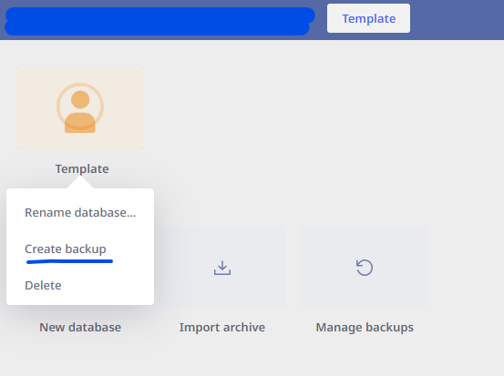

5. Uncheck the all the checkboxes and click ok.

6. The `Manage backups` tab should open, if not navigate to it.
7. Navigate to the `Manual backups` tab.
8. Find the backup you just created and click `Download backup` and download it to your device.

> [!TIP]
> If the backup is not there, close the `Manage backups` tab and open it again.

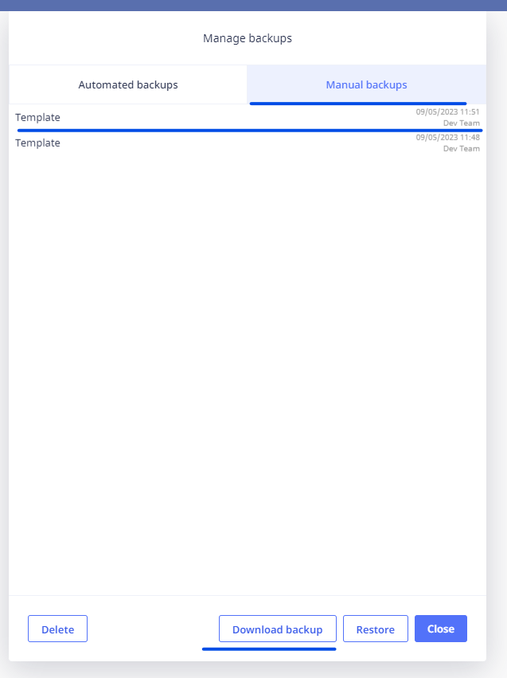

## Uploading Steps

1. Open the Ninox team page where you want to upload the database.
2. Click the `Import archive` button.
3. Enter the new name of the database.
4. Click `Choose file` and select the backup you just downloaded.

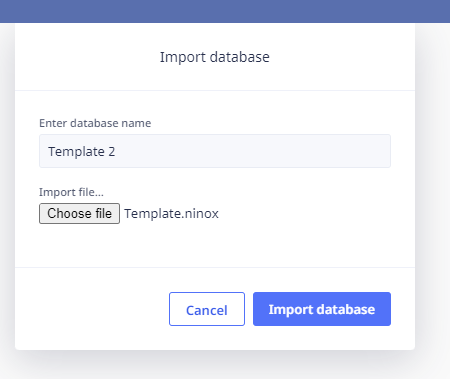

5. Click `Import database` and the new Template database should be added to the team.

> [!NOTE]
> It can take a few minutes for the database to be added to the team.

## Setting up the database

### Adding the `View`

1. Open the new database.

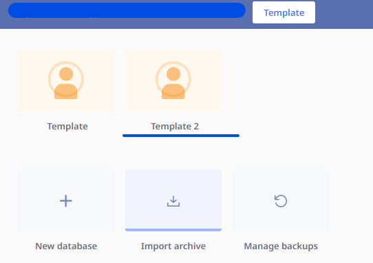

2. Navigate to the `My Contacts` tab.
3. Click the `+` button to add the `View`.

> [!NOTE]
> Since we unchecked the checkboxes to not include the data, we need to start by adding some things manually.

### Adding images to the `ImageLibrary` table

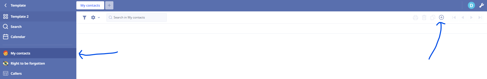

4. Now click on the `Tool` icon to see all the other tables.

> [!NOTE]
> Depending on the complexity of the database, some elements or tables might be different for what you need.

5. Navigate to the `ImageLibrary` table.

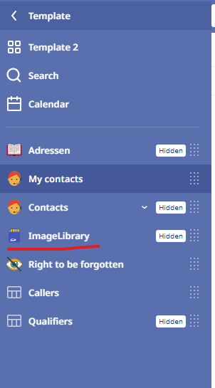

6. Download the next two images and upload it to the `ImageLibrary` table.

> [!WARNING]
> It should look like this after you've uploaded the images. **The first image should be the fire icon**

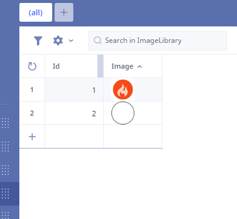

### Editing qualifiers

Since each database and projects may be different, you need to edit the qualifiers to match the project. There are currently 2 templates to choose from. Templates with separate `Qualifiers` table and templates with `Qualifiers` directly in the `Adressen` table. The latter being less complex and easier to use.

#### Editing `Qualifiers` in the `Adressen` table

1. Click the `Tool` icon and then navigate to the `Adressen` table.
2. Click the `Settings` icon and then click `Edit fields`.

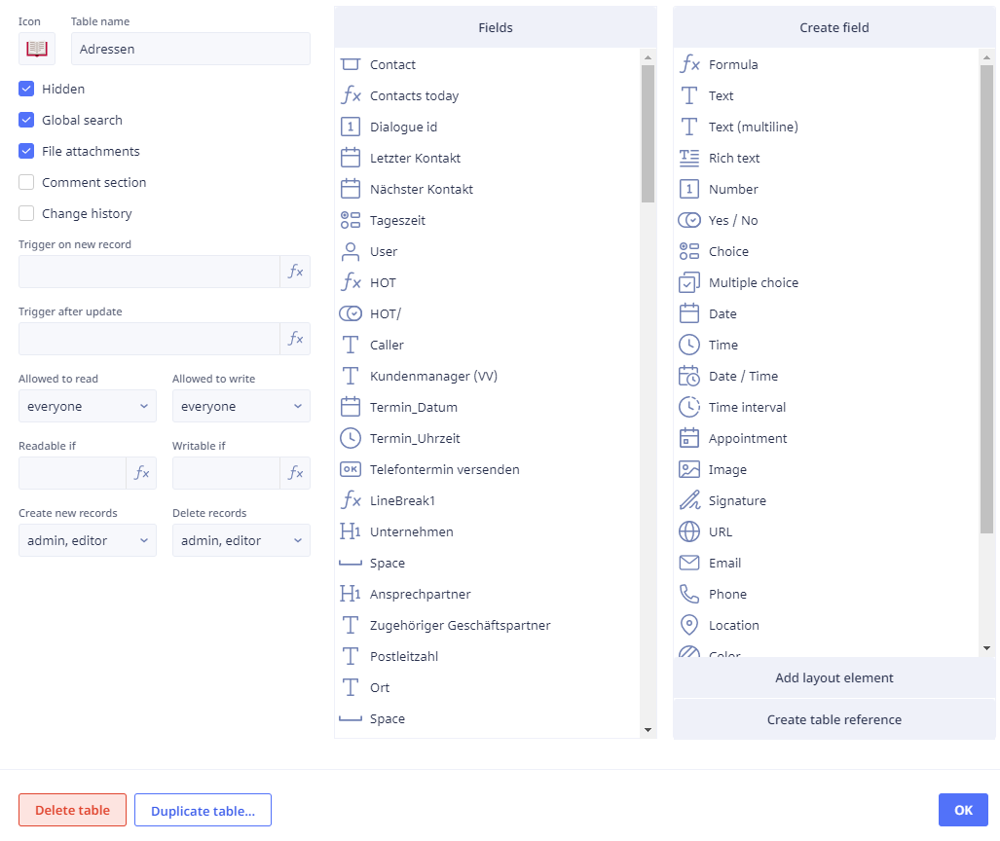

3. Here you can drag new items from the right to left to create new fields.
4. You can editing the fields in question by clicking on them **(on the left side)**.
5. The below image shows the `Salutations` dropdown item field.

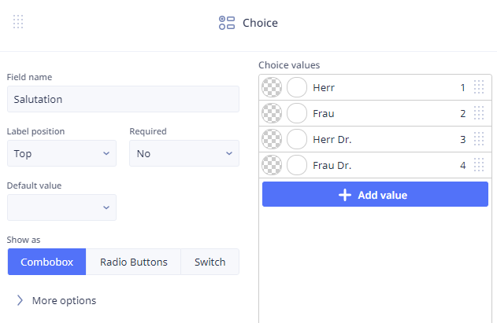

> [!WARNING]
> In the next section we will go over how to import new data into the database, there it's mentioned that the `dropdown values` in the CSV file need to be the exact same as the ones in the database. In this example if the salutations in the CSV file are `Mr` and `Ms` and not `Herr` and `Frau` then you need to change the `dropdown values` here to match that.

#### Editing `Qualifiers` in the `Qualifiers` table

1. Click the `Tool` icon and then navigate to the `Qualifiers` table.
2. Click the `Settings` icon and then click `Edit fields`.
3. As before you can drag new items from the right to left to create new fields.
4. You can editing the fields in question by clicking on them **(on the left side)**.

#### Editing `Qualifiers` in the `Adressen` `View`

1. Click the `Tool` icon and then navigate to the `Adressen` table.
2. Click on one of the contacts to open the `View`.

> [!TIP] If there are no contacts in the address book, then you need to add one.

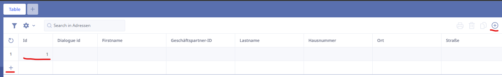

3. Clicking on the tool icon in the view will make the fields editable and draggable.

> [!TIP]
> In the bottom navigation bar, you can see that you can edit fields, add fields, formulas, layout elements, link to and from other tables and create a sub table.

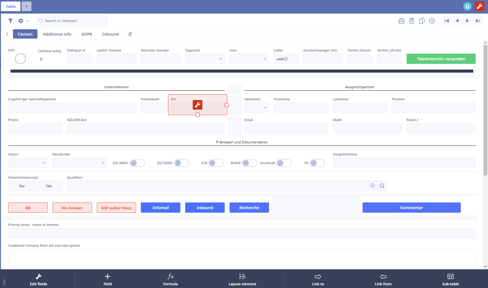
