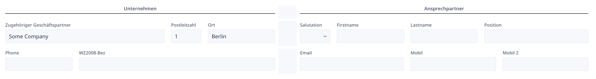

> # Database structure

In this section, we will explore the database structure within Ninox. Central to this structure is the Address table, which acts as a comprehensive repository for contact information provided by our clients. Consisting of both consistent and customizable fields, such as Dialogue ID, Caller, HOT status, Last Contact, Next Contact, and Meeting details, the Address table ensures essential information is organized and easily accessible.

Alongside the Address table, the Contacts and Meetings subtable capture and track every interaction, allowing for a detailed overview of each contact's history. Additionally, the Rights to be Forgotten table provides a dedicated space to manage data deletion requests in compliance with GDPR regulations. As we delve into the intricacies of the database structure, you will gain a comprehensive understanding of how to effectively leverage the power of Ninox.

## Structure

## Address Table

The Address table serves as a repository of contact information provided by clients for lead generation. It contains several columns that may vary based on client preferences. However, there are consistent fields that exist across all clients:

1. Dialogue ID: Unique identifier for each contact.
2. Caller: Name of the consultant assigned to the contact.
3. HOT: Indicates the level of interest or priority assigned to the contact.
4. Last Contact: Date and time of the most recent contact with the lead.
5. Next Contact: Scheduled date and time for the next contact.
6. Meeting Date: Date of the scheduled meeting.
7. Meeting Time: Time of the scheduled meeting.

> [!Note]
> There are more fields that are fixed, but these are the examples

> 
In the Address table view, you would see these fields

In addition to the consistent fields, there are contact details specific to each lead, including:

- Company Name: Name of the lead's company.
- City: City where the lead is located.
- Zip: ZIP or postal code of the lead's location.
- Phone: Contact phone number.
- Pronoun: Pronoun used to address the lead.
- First Name: First name of the lead.
- Last Name: Last name of the lead.
- Position: Position or title of the lead.
- Email: Email address of the lead.
- Mobile: Mobile phone number of the lead.

> [!Note]
> Depending on the data structure we receive from the client, these fields may also vary

> 
In the Address table view, you would see these fields

## Qualifiers

Qualifiers are fields used by consultants to assess the relevance or interest level of the contacts. These qualifiers may either be direct columns within the Address table or separate tables connected through relationships, depending on their complexity and variability across clients.

## Contacts Table

The Contacts table is used to capture each interaction made with the leads. It is connected to the Address table through a relationship. Whenever a consultant uses the contact button in the Address table view, a new contact entry is created in the Contacts table. This enables tracking and storing of all interactions related to a specific contact.

## Meetings Subtable

The Meetings subtable is a subtable within the Contacts table. It serves the purpose of recording meeting-related information. Similar to the Contacts table, the Meetings subtable is connected to the Address table via a relationship. Whenever a meeting is scheduled, a new contact entry is created, and the relevant meeting details are stored in the Meetings subtable.

## Rights to be Forgotten Table

The "Rights to be Forgotten" table is designed to handle requests from individuals who wish to have their contact data deleted for GDPR (General Data Protection Regulation) compliance purposes. When a person requests data deletion, a new record is created in this table, capturing relevant information and actions taken.

The "Rights to be Forgotten" table includes the following fields:

1. Contact ID: Unique identifier linking the record to the contact in the Address table.
2. Email Sent to Contact: Indicates whether an email has been sent to the contact confirming the deletion of their personal data.
3. Date/Time: Date and time of the deletion request or related actions.
4. Request Type: Dropdown field specifying the method through which the deletion request was made, such as email or telephone.

When a person requests their data to be deleted, a new record is created in the "Rights to be Forgotten" table, capturing the relevant contact ID. Subsequently, the personal information associated with that contact is deleted from the Address table to fulfill the GDPR requirements.

By maintaining a separate table for rights to be forgotten requests, you can effectively track and document the actions taken to address these requests while ensuring compliance with data protection regulations.

## Image Library

The "Image Library" is utilized to provide a visual cue, in the form of fire circle emoji or no emoji, to the consultants based on the "HOT" status of contacts. This feature enhances the user interface and aids in quickly identifying the priority or level of interest associated with each contact.

The Image Library is connected to the main Address table to load and display the appropriate images based on a formula. The formula determines whether the "HOT" field is set to "Yes" or "No" and selects the corresponding image accordingly.

The functionality of the Image Library can be summarized as follows:

1. Fire Circle Emoji: When the "HOT/" field in the Address table is set to "Yes," the formula in the Address table loads loads and displays a fire circle emoji as a visual indicator of high priority or interest.

2. No Emoji: When the "HOT/" field in the Address table is set to "No," the formula in the Address table loads and displays no emoji, indicating a neutral or non-priority status.

By leveraging the Image Library feature, consultants can quickly identify and prioritize contacts based on the presence or absence of the fire circle emoji associated with the "HOT" field.

> [!NOTE]
> There are two HOT fields in the Address table, one is a dropdown "HOT/" and one is the formula field "HOT"