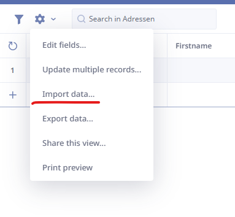

> # Managing Data

## Importing Data

> [!TIP]
> Ninox has detailed documentation about how to import data. **[Link to Ninox documentation](https://docs.ninox.com/en/manage-databases/import-and-export/csv-import)**

Importing data into the Ninox database allows you to quickly populate the Addressen table with existing contact information. Follow the steps below to ensure a successful import:

1. Navigate to the `Adressen` table by selecting it from the sidebar. This table serves as the central repository for contact information.

2. In the toolbar, click the settings wheel button, and then select `Import data` from the dropdown menu. This action will open the Importing wizard, guiding you through the import process.

> [!NOTE]
> The following module is the Importing wizard. It provides step-by-step instructions to import data effectively.

3. Click `Next` and select the CSV file you want to import. Note that the data must be in CSV format. Ensure that the CSV file contains the necessary contact information.

> [!NOTE]
> It's essential to ensure that the data in the CSV file matches the expected format in Ninox. Additionally, pay attention to the **date** and **number** formats in the CSV file and make sure to select the according format in Ninox, as they need to match between the CSV file and the Ninox database.

4. In the next step, assign the columns from the CSV file to the corresponding fields in the Ninox database. Drag and drop the items from the right column labeled `Available fields` to the left column labeled `Fields to import`. This mapping process ensures that the data is correctly placed in the appropriate fields.

> [!NOTE]
> The column names in the CSV file may differ depending on the setup of the database. Therefore, ensure that you map the columns accurately to avoid any data discrepancies.

**The `HOT` field in the right column is a formula field that displays the fire circle emoji based on the value of the `HOT` column in the CSV file. To import the correct value, use `HOT/` in the mapping.**

**The `Id` field in the right column represents an auto-incremented ID generated by Ninox. It is not necessary to import this field, so you can ignore it. However, ensure that the `Dialogue id` field either exists in the CSV file before importing or use the existing Dialogue Id from the `Access` database.**

5. Click `Next` to preview the changes made by the import process. Review the preview carefully to ensure that the data is correctly aligned with the desired fields in the Ninox database.

6. Verify that the dates are correctly imported and displayed in the preview. Pay attention to the date format, as Ninox uses your system's default settings. Even if you specified `yyyy-mm-dd` in the import wizard, the dates may be displayed as `dd-mm-yyyy` in Ninox.

7. Review the Time fields to confirm that they were imported correctly. This step ensures that the time data is accurately reflected in the Ninox database.

8. Check other fields, such as `HOT`, and dropdown items like `qualifiers`, to verify their correct import. For the `HOT` field, ensure that the CSV file contains either `yes` or `no` to indicate the priority status accurately.

**Dropdown item fields in the CSV file must match the exact options in the database. If there are any discrepancies, make the necessary adjustments in the database to ensure data consistency.**

## Creating a New Record

To add a new record to the `Addressen` table, follow these steps:

1. Navigate to the `Adressen` table by selecting it from the sidebar. This table contains the records of all contacts.

2. Click the `+` button located in the toolbar to add a new record. This action activates the editing mode and allows you to input the details for the new contact.

3. In the popup window, fill out the required fields for the new contact. Although not all fields may be mandatory, it's important to provide the necessary information such as `Dialogue Id`, `Company name`, and phone numbers.

> [!NOTE]
> Ensure that all required fields are filled out, as they play a crucial role in managing and organizing the contact data. The `Dialogue Id` should have a value one number higher than the highest `Dialogue Id` number currently present in the database, ensuring uniqueness for each contact.

## Deleting a Record

To remove a record from the database, follow these steps:

1. Locate the contact record you wish to delete in the contact view of the `Addressen` table.

2. Click on the trash can icon associated with the record. This action will initiate the deletion process. Note that in some cases, administrative privileges may be required to delete a record.

> [!NOTE]
> Exercise caution when deleting records, as the deletion process is irreversible. Make sure to review and confirm the deletion before proceeding.
