> # Project Management for Ninox

This documentation is about the project management team for Niniox, it will cover the development plan, roles and responsibilities.

## Development Plan

> In the current phase we are transferring projects from Access over to Ninox, we have a few more projects to go before we are done. After that we will be working on the new features for the Ninox database.

## Roles and Responsibilities

> Bellow is a diagram of the roles and responsibilities of the teams and individuals involved in Ninox database projects.

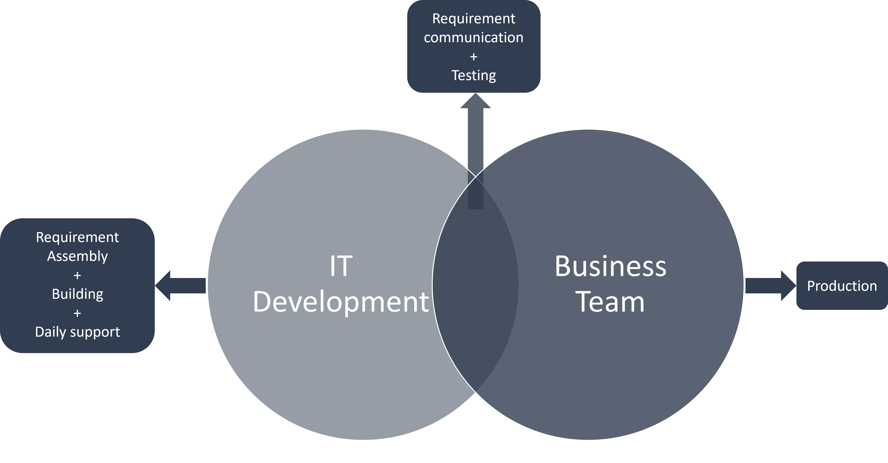

> In short, the idea is that:

1. **Dev Team and Project Lead** assemble the requirements for for the business process based on the current `Access` database.
2. **Dev Team** then create a database based on the requirements.
3. **Dev Team** then pushes the database to `pre-production`.
4. **Dev Team** then communicate with the `project lead` and test the database to make sure the data, qualifiers and processes are correctly implemented,
5. **If not Dev Team will then fix it**.
6. **Project Lead will** take ownership:
   - Get training on how to use the database.
   - Get training on how to support minor issues.
   - Train the team on how to use the database.
   - Test the database and report any bugs or issues to IT.
7. **Dev Team** then support the database.

> All the while `Super Users` can assist in each of the phases of development.

> This diagram shows the flow of the development process.
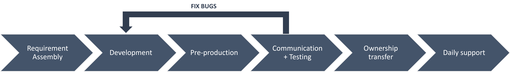

> [!WARNING]
> If the below diagrams do not load please refresh the page.

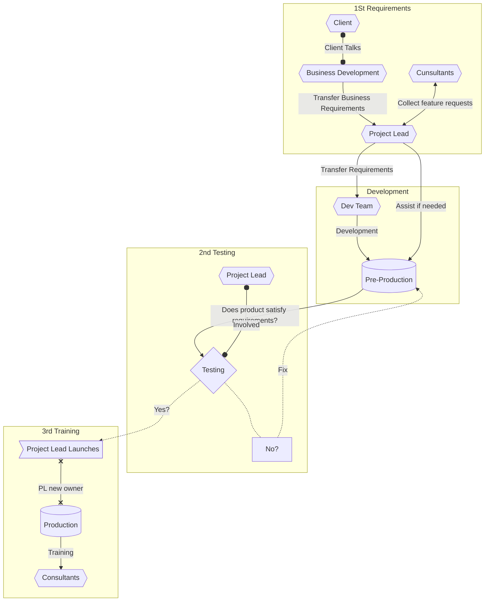

> ### Project Leaders

The team leaders are the team leads in the German business units.

#### Responsibilities

The team lead will coordinate with the developers on the business processes and the database structure. They give invaluable insights into how the lead generation process works and how the database should therefore be structured, thereafter, assisting in testing and launching the database. They will also be responsible for the training of the users and the support their own database.

> Project Leaders should be trained so that they can do the following easy tasks themselves:

1. Can add new users to Ninox and to their project on Ninox
2. Can deactivate inactive users
3. Import/Export data
4. Alter/Edit fields, tables and views

#### Tasks during development

##### 1. Get business process requirements and collect feature requests from consultants

This means acquiring the business process requirements from the business development team and and collecting feature requests from the consultants.

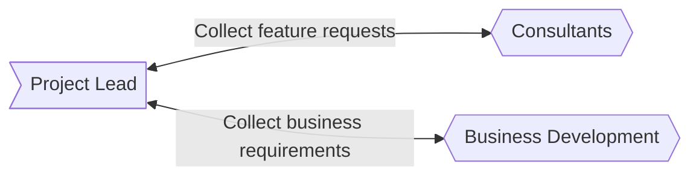

##### 2. Communicate with the Dev Team on how the business processes should be implemented & assist in development if needed

When the Dev Team is developing the database the Project Lead should be available to answer any questions the Dev Team might have about the business processes. The Project Lead should also assist in the development if needed.

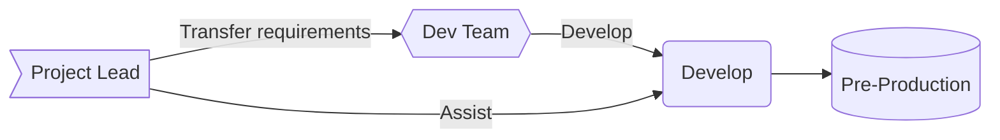

##### 3. Test the database and report any bugs or issues to the development team

When the database is ready for testing the Project Lead should test the pre-production database and report any bugs or issues to the Dev Team. If the database does not satisfy the business requirements the Project Lead should report it to the Dev Team and the Dev Team will fix it, otherwise the Project Lead will give the green light on launching the database.

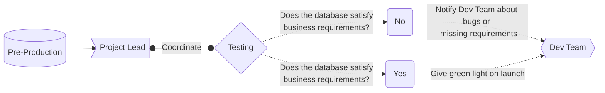

##### 4. Take ownership of production database and train the users on how to use the database

Once the database is launched the Project Lead will take ownership of the database and train the users on how to use the database. The Project Lead will also be responsible for supporting the users on minor issues.

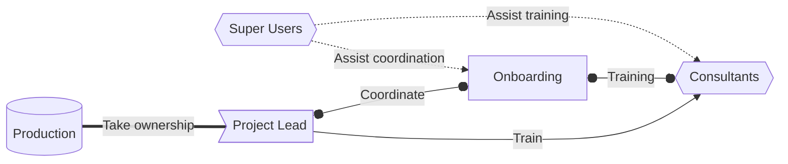

##### 5. Support the users on minor issues

When the users have issues with the database they should contact the Project Lead first, if the Project Lead cannot solve the issue they should contact the Super Users. If the Super Users cannot solve the issue they should contact the Dev Team.

Supporting the users on minor issues involves:

- Solving minor issues
- Training the users on how to use the database
- Asking the Super Users for help if needed
- Reporting **major** issues to the Dev Team

> The support sequence when Project Lead is first point of contact

The sequence of events ideally follows these steps:

1. The user has an issue with the database.
2. The user contacts the Project Lead.
3. The Project Lead solves the issue.

**If the Project Lead cannot solve the issue**

4. Project Lead contacts the Super User.
5. Super User solves the issue by either providing directions or making changes in the database **(consulting PL)**.
6. Super User reports any changes to the Project Lead.
7. Project Lead reports any changes to the user.

**If the Super User cannot solve the issue**

4. Super User contacts the Dev Team.
5. Dev Team solves the issue by making changes in the database.
6. Dev Team reports any changes to the Super User.
7. Super User reports any changes to the Project Lead.
8. Team Lead reports any changes to the consultants.

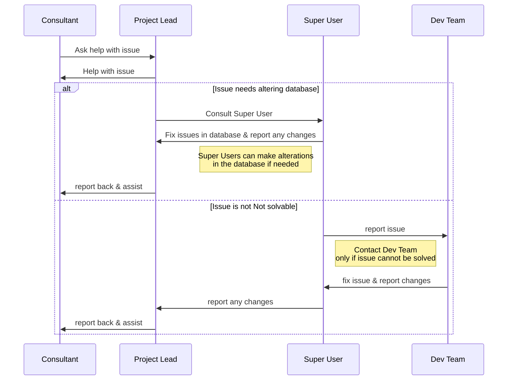

> [!NOTE]
> There are different sequences for when any role is the first point of contact.

> ### Super Users

Consultants in the German business units.
#### Responsibilities

The super users are the consultants in the German business units that are very familiar with Ninox and can assist consultants with minor to major issues. They should be knowledgeable enough to be able to solve most issues and if not, they should be able to communicate the issue to the development team. 

This requires that they have a good understanding of the business processes across the different projects, database structure and functionality. Furthermore they should be able to train the consultants on how to use the database and assist the  Dev Team in implementing and testing databases.

#### Tasks

> ##### 1. Assist in development if needed

This involves assisting the Dev Team in implementing and developing the database. Including:

- Altering fields, tables & views if needed
- Altering the database structure if needed
- Altering the database functionality if needed
- Developing new features if needed
- Developing new Views if needed

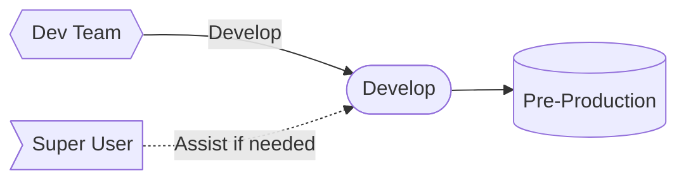

> ##### 2. Assist in the testing phase if needed and report any bugs or issues to the development team

This involves assisting the Project Leaders in testing the pre-production database and reporting any bugs or issues back to them. **The decision on whether the database is ready for launch is made by the Project Lead.**

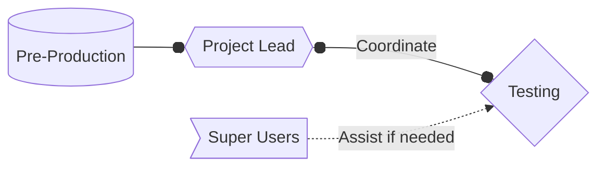

> ##### 3. Assist in training the consultants on how to use the database

This involves assisting the Project Leaders in training the consultants on how to use the database. **Super users should coordinate their efforts with the Project Leaders to ensure that the training is done according to the business process across the different projects.**

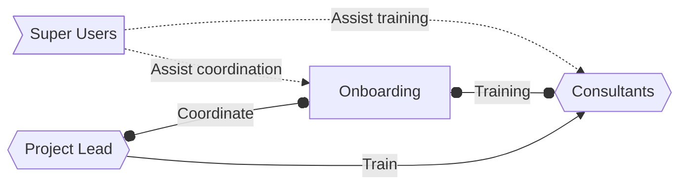

> ##### 4. Alter fields, tables & views in the database if needed

This involves assisting Project Leaders in altering fields according to new business requirements or in case of bugs.

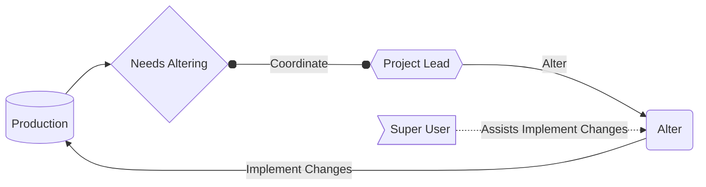

> ##### 4. Develop features and implement them in the database

This involves assisting Project Leaders in developing new features according to new business requirements or in case of feature requests.

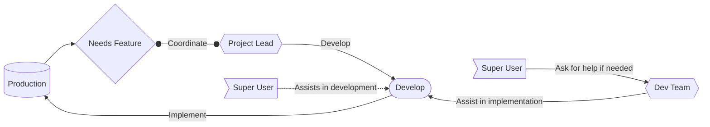

> ##### 5. Manage data imports/exports

This means that the Super Users should be able to import and export data from the database. This includes:

- Importing data from CSV files
- Exporting data to CSV files (in the format required by the client)
- Ensuring that the data is imported correctly
- Ensuring that the data is exported correctly

> ##### 6. Support the consultants on issues

When the consultants have issues with the database, and the Super User is their first point of contact. The Super Users should then assist the consultants in solving the issue. This involves:

- Assisting the consultants with guidance
- Altering fields, tables & views if needed **(Consult with Project Lead)**
- Altering the database structure if needed **(Consult with Project Lead)**
- Altering the database functionality if needed **(Consult with Project Lead)**
- Developing new features if needed **(Consult with Project Lead)**
- Developing new Views if needed **(Consult with Project Lead)**

If the issue is not solvable, the Super Users should contact the Dev Team.

> The support sequence when Super User is first point of contact

Ideally the sequence of events are as follows:

1. Consultant contacts Super User
2. Super User assists consultant

If the issue is needs altering the database

3. Super User consults with Project Lead
4. Project Lead gives green light on altering database
5. Super User fixes issues & assists
6. Super User reports any changes

If the issue is not solvable

3. Super User reports issue to Dev Team
4. Dev Team fixes issue & reports any changes
5. Super User reports back & assists
6. Super User reports any changes

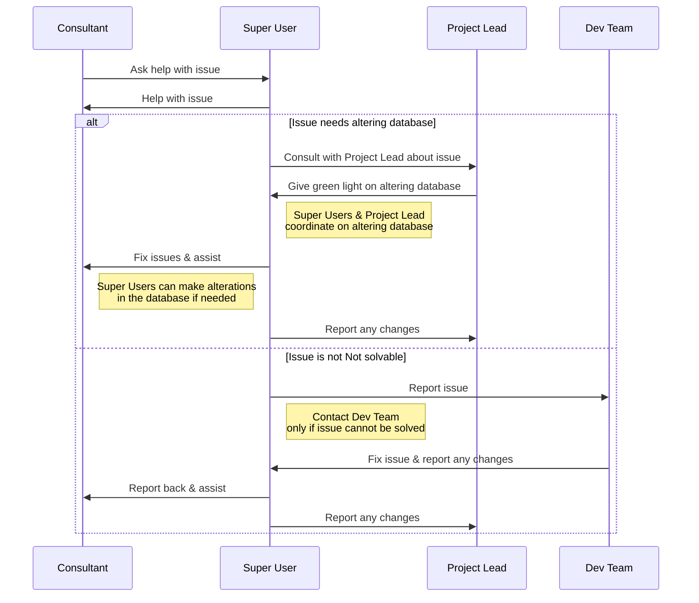

> [!NOTE]
> There are different sequences for when any role is the first point of contact.

> ##### 7. Identify potential in Ninox across projects  

- Communicate with different project consultants to identify learnings and features implemented in different projects.
- Know the potential of Ninox and think about how to best use that potential to enhance efficiency across projects

### Development Team

The Development Team, consisting of developers from the IT team, plays a crucial role in implementing and maintaining the Ninox database. Their responsibilities involve developing the database based on the requirements provided by the Project Leads, ensuring database maintenance, offering user support, and providing documentation and training to users.

#### Responsibilities

The Development Team has the following key responsibilities:

1. **Database Development**: The team is responsible for developing the Ninox database, ensuring that the business processes and requirements communicated by the Project Leads are implemented effectively.

2. **Database Maintenance**: The team is responsible for maintaining the database, including making necessary alterations, modifications, or additions to fields, tables, and views, based on the evolving business needs.

3. **Super User Support**: The team provides support to users by addressing their queries, troubleshooting issues, and resolving technical problems related to the database.

4. **Documentation**: The team ensures that comprehensive documentation is created for the Ninox database, including guidelines, manuals, and reference materials, to assist users in understanding the functionalities and best practices.

5. **Training**: The team conducts training sessions for Super Users, focusing on familiarizing them with the database's features, functionality, and workflows. They ensure that users have the necessary skills and knowledge to effectively utilize the database for their specific tasks and responsibilities.

> [!NOTE]
> The Development Team works closely with the Project Leads and Super Users to align their efforts and ensure that the database development meets the requirements and expectations of the business units.