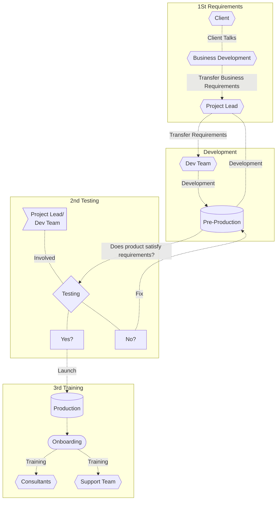

> # Project Management for Ninox

This documentation is about the project management team for Niniox, it will cover the development plan, roles and responsibilities.

## Development Plan

> In the current phase we are transferring projects from Access over to Ninox, we have a few more projects to go before we are done. After that we will be working on the new features for the Ninox database.

## Roles and Responsibilities

> Bellow is a diagram of the roles and responsibilities of the teams and individuals involved in Ninox database projects.

> The idea is that:

1. **Dev Team and Project Lead** assemble the requirements for for the business process based on the current `Access` database.
2. **Dev Team** then create a database based on the requirements.
3. **Dev Team** then then push the database to `pre-production`.
4. **Dev Team and Project Lead** then communicate with the team lead and test the database to make sure the data, qualifiers and processes are correctly implemented,
5. **If not Dev Team will then fix it**.
6. **Project Lead will** take ownership:

   - Get training on how to use the database.
   - Get training on how to support minor issues.
   - Train the team on how to use the database.
   - Test the database and report any bugs or issues to IT.

7. **Dev Team** then support the database.

> ### Project Leaders

The team leaders are the team leads in the German business units.

#### Responsibilities

The team lead will coordinate with the developers on the business processes and the database structure. They give invaluable insights into how the lead generation process works and how the database should therefore be structured.

> ### Development team

The development team are the developers in the IT team. **`Ingimar`** **`Clara`**. And two developers from the German business units.

#### Responsibilities

The responsibilities of the development team are to develop the database by implementing the business processes as communicated by Project Leads. They will also be responsible for the maintenance of the database and offer support to the users. Furthermore they will be responsible for the documentation of the database and training of the users.

> ### Testers

The testers are the Project Leads in the German business units, the developers and the end users.

#### Responsibilities

The testers will test the database and report any bugs or issues to the development team, which includes checking if the business processes are implemented correctly, do data validation and label checks.
