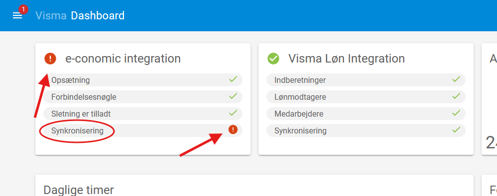

# Product Maintenance and Troubleshooting

### General Approach to Issues and Questions in Visma Time

For questions or issues, the following approach can be taken:

1. Check these documentations for answers.
2. Refer to [Visma's own guidelines](https://community.visma.com/t5/Vejledninger-i-Visma-Time/tkb-p/DK_EN_Visma-Time_Vejledninger) for further information.
3. Use [Visma's Customer Portal](https://vismaenterpriseas.my.site.com) for additional help and assistance.

_**Who should be contacted for access to the customer portal?**_

### Error in Integration with Visma Løn or e-conomic

If there is an error in the integration with either Visma Løn or e-conomic, it will be displayed on the dashboard in Visma Time, as shown in the image below. To correct the error, open a ticket in the [customer portal](https://vismaenterpriseas.my.site.com) with information about where the error is.  
In the example below, the error is in the **synchronization** within the integration with **e-conomic**. Visma will then address the issue.

