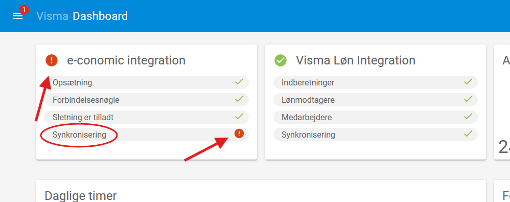

# Support and Troubleshooting in Visma Time

On this page, you will find information about the general approach to problems and questions related to Visma Time, as well as answers to some common, specific issues.

## General Approach to Issues and Questions

For questions or issues, the following approach can be taken:

1. Check these documentations for answers.
2. Refer to [Visma's own guidelines](https://community.visma.com/t5/Vejledninger-i-Visma-Time/tkb-p/DK_EN_Visma-Time_Vejledninger) for further information.
3. Use [Visma's Customer Portal](https://vismaenterpriseas.my.site.com) for additional help and assistance.

## Common Issues and How to Fix Them

Below is a list of some common errors and how they can be resolved.

### Project is not Available for Time Reporting

If a project is not available when reporting time, the cause could be due to several factors:

**Projects Are Not Updated in the Browser/App**
Refreshing the page or app ensures that the projects the employee has access to are up to date. In the app, pull down from the top to refresh.

**Employee access on the project and sub-project**  
Make sure the [department has access](Product_documentations/visma_time/Projects/employee_access.md) to both the project and sub-project.

**Department on the employee**  
Make sure the [employee is added to the correct department](Product_documentations/visma_time/Employees/new_employees.md#adding-the-new-employee-to-a-department).

**Activities on the project and sub-project**  
Make sure [activities (e.g., "Arbejdstid") are added](Product_documentations/visma_time/Projects/activities.md) to both the project and sub-project.

**The project's status**  
Make sure the [project is active](Product_documentations/visma_time/Projects/closing_project.md).

If none of the above work, refer to [Visma's own guidelines](https://community.visma.com/t5/Vejledninger-i-Visma-Time/tkb-p/DK_EN_Visma-Time_Vejledninger) or contact [Visma's support](https://vismaenterpriseas.my.site.com) for additional help and assistance.

### Error in Integration with Visma Løn or e-conomic

If there is an error in the integration with either Visma Løn or e-conomic, it will be displayed on the dashboard in Visma Time, as shown in the image below. To correct the error, open a ticket in the [customer portal](https://vismaenterpriseas.my.site.com) with information about where the error is. In the example below, the error is in the **synchronization** within the integration with **e-conomic**. Visma will then address the issue.

