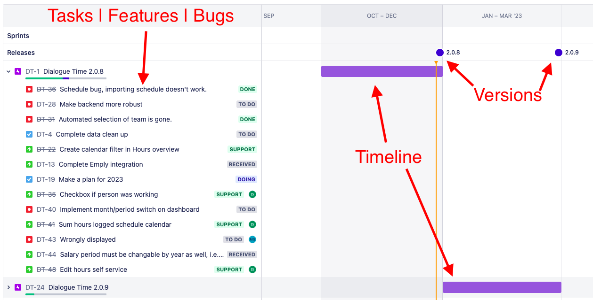
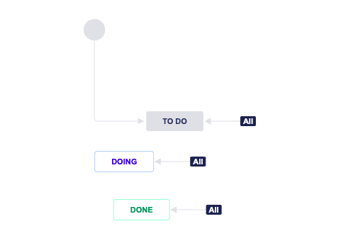
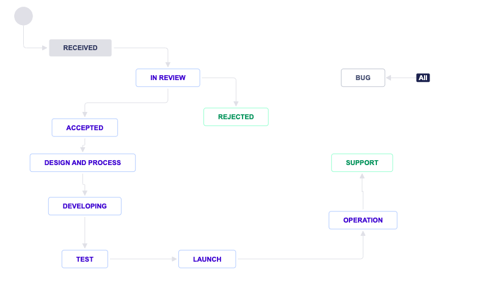

> # Framework

## Agile Scrum 
Scrum is a type of agile project management methodology that involves breaking projects down into smaller chunks. It is often used for businesses that need to complete specific projects quickly and efficiently. Dialogue Time product was developed using the agile scrum methodology, which allows for flexibility in the event that the functional and non-functional requirements need to be modified. The product was released in stages, with each stage having a different version number. When a new version was pushed to production, users were prompted to update their Progressive Web Application (PWA) to access the new features. These features were either defined in the product requirements or added as priority requests during review points.

### Tools
* [Jira](https://www.atlassian.com/software/jira) - Jira is a project management tool that can be used to create and manage roadmaps. Here are some ways to use Jira for roadmaps:
* [Confluence](https://www.atlassian.com/software/confluence) - Confluence is a project management tool that can be used to create and manage roadmaps. Here are some ways to use Confluence for roadmaps:

## Roadmap

In Jira, a roadmap is a visual representation of a team's plans for the future. It can be used to communicate the goals and priorities of a project or product to stakeholders, and to track progress towards those goals.

To create a roadmap in Jira, you can use the Roadmap feature, which is available in the Jira Software and Jira Align products. With this feature, you can create a visual representation of your plans by grouping issues into versions, which represent different stages or phases of your project. You can then assign these versions to specific time periods, such as quarters or months, to create a timeline for your roadmap.

In addition to versions, you can also use components and labels in Jira to further organize and group your issues. Components can be used to represent different parts of your project, while labels can be used to identify specific types of issues or to represent different priorities.

You can view and update your roadmap in Jira by selecting the Roadmap tab in the navigation menu. From here, you can see a high-level overview of your plans, as well as drill down into specific versions or issues to see more detailed information. You can also use the Roadmap feature to track progress towards your goals by updating the status of your issues as you work on them.

To see more information about Jira, visit the [Jira website](https://www.atlassian.com/software/jira).

## Workflow

In the context of project management, a workflow is a series of steps or tasks that are required to complete a specific process or goal. Workflows are often used to define and standardize how work is carried out within an organization, and can be used to improve efficiency and productivity.

## Jira

In Jira, a workflow is a set of rules that define how issues should move through different stages of a project. Each workflow consists of a series of statuses and transitions that represent the different steps involved in completing an issue. For example, an issue might start in a "To Do" status and then move to a "In Progress" status as work begins. Once the work is completed, the issue might be moved to a "Done" status.

Workflows can be customized to meet the needs of a specific project or team. For example, you can add or remove statuses or transitions, or create rules to automatically move issues between statuses based on certain conditions.

You can view and manage workflows in Jira by going to the "Workflows" section of the administration area. From here, you can create new workflows or edit existing ones, as well as view and update the rules and settings for each workflow.

## Git

In the context of Git, a workflow refers to the process that a team follows when using Git to manage their codebase. Git is a version control system that allows developers to track changes to their code and collaborate on projects with other team members.

* There are many different Git workflows that teams can follow, depending on their needs and preferences. Some common Git workflows include:

* The central repository workflow, where all team members push their changes to a central repository, and changes are reviewed and merged by a designated team member.

* The feature branch workflow, where developers create a separate branch for each new feature they are working on, and merge their changes into the main branch once they are completed.

* The fork and pull request workflow, where developers create their own copy of the repository (a "fork"), make changes on a branch in their fork, and then create a pull request to request that their changes be merged into the main repository.

Regardless of the specific workflow that a team follows, the goal is typically to enable team members to work collaboratively and efficiently, while also maintaining a clear history of changes to the codebase.
