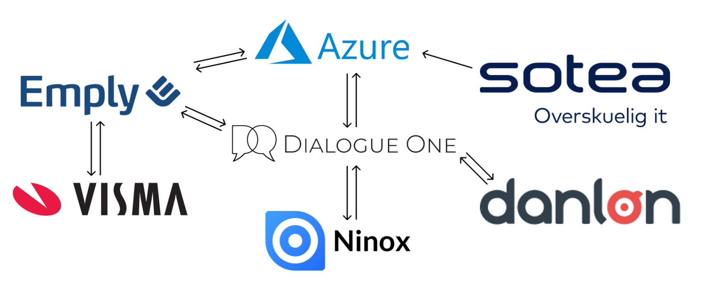

> # Product requirements

## Functional Requirement
There are two stages to the functional requirements. The original requirements must first be met, and then we could start working on the updated requirements.

### The original requirements
Dialogue Time was initially centred around the consultants working in the business unit. However, since most consultants employed have a freelance contract type, the requirements revolved around the freedom to choose when they work. They would then invoice their hours accordingly using the application.
This makes the user flow and functional requirements different from similar tools like Planday since there is a need to be able to organise and plan employee capacity and output for the upcoming months for clients. However, a need for flexibility allows consultants to change their schedules and log their hours at will.

**Other requirements also include:**

**Administrative features**
- Adding hours for consultants or schedule for them. 
- Adding, updating or removing tasks or projects. 
- Editing consultants schedule and hours logged. Exporting data.

**User features**
- Exporting of hours logged.
- Overview of schedule.
- Overview of hours logged.
- Overview of company’s entire schedule. Table capacity booking system (schedule).

## The updated requirements
Not only includes both the original requirements mentioned and also the integration capabilities mentioned in the business case.

### Self service integration
As a part of the automation requirements of the project, specific procedures were revisited and redefined, with the end goal being the reduction of administrative overhead. Part of this was self-service integration, where consultants have more control of their data, hours, schedule etc.

### Payroll 
Previously, hours were logged as individual entries, and at the end of each salary period, the CEO spent a significant amount of time reviewing these entries before paying salaries. This process was prone to errors and was often complicated by consultants requesting special circumstances, such as deferring hours to the next period. As the company grew, it became clear that this process was inefficient and costly.

To address these issues, it was decided to implement self-service features inspired by web and mobile banking, as well as stricter protocols to ensure data consistency and accuracy in the hours logged. This included the creation of an integrated self-service API that could perform the same tasks as the CEO and provide better validation.

The new functionality would offer a more efficient and convenient experience for consultants, allowing them to defer hours to future periods and access their upcoming and past salary balances easily. Additionally, redesigning the database to use double transactional data for hours logged would create a ledger for salary purposes.

### Personal data 
In the company, the administration of employee personal data had been a manual process involving the scanning and uploading of physically signed documents to a shared folder structure. However, as the company grew and the number of consultants increased, this process became more burdensome and created an increase in administrative work for the HR department.

To alleviate this administrative overhead, it was proposed to create a self-service portal within Dialogue Time, where consultants could review and update their personal data.

## Non-Functional Requirements

### Speed
The app should be fast enough to meet users expectations, but speed is not the highest priority.
Being of a sovereign posture type, users are not deterred away from Dialogue Time due to it being slow. However, it is important to meet users’ expectations; users do not expect to wait 5 minutes for the application to render.

### Security
The app must not concern itself with account management. One of the most significant administrative overheads is account management, which can be resolved with automation.

Therefore this non-functional requirement’s scope includes.

- Account management
- Account locking
- Password generation
- Security question answering

### Portability
The app should be accessible anywhere
Although Dialogue One has an office, many consultants work from home, which means that the operation is indifferent if the work is done remotely or not. The application, therefore, must be accessible anywhere at any time in the world.

### Localization
The app should be aware of the users locale
Most consultants working for Dialogue One are international students living in Denmark, but other consultants live and work in other regions. The application, therefore, must be aware of the users’ locale. If a consultant is scheduled to work from Denmark, the time zone difference should be reflected for another consultant who might be accessing the application in Dubai, for example. Furthermore, adding a Danish and German language option would be optimal for an increased user experience.

### Compatibility
The application must be highly compatible for all devices
As many consultants use their own devices for work, the application must be compatible with any device and platform. That being said, the application use case and information architecture favour desktop type devices over mobile devices. Therefore, the application must accommodate for these shortcomings, possibly by creating separate views and functionality for each use case.

### Reliability
The application must be highly reliable with less than 0.1% downtime
One of the original functional requirements is to serve the business unit, which relies heavily on it, to calculate KPIs for invoicing and project capacity planning. Therefore, the application must almost always be running without downtime.

### Navigation
The application must easy to navigate.
Even though the application is of a sovereign posture, the goal is to reduce unnecessary work hours. Therefore, each section or page reflects a user’s necessity to be there.

### Purpose of features
The Purpose of the features of the application must reflect actual business needs concerned with Dialogue Time.
Even though there are many wishes for nice-to-have features from the different departments, keep in mind that the goal is to develop a centralized environment intended to increase automation and reduce administrative overhead. The new Dialogue Time should not be any replacement but a tool. Therefore, developing features that do not correlate with work processes should be avoided.

## Integration requirements
In figure picture below, you can see a diagram of the products intended for integration. It represents the expected dependency relation between them once the project is complete, be it the data flow or the governance of one product over the other.

### Microsoft Graph
Microsoft Graph is a tool which offers an extensive array of services using a single API endpoint; it provides access to rich people-oriented data and insights into the organization’s cloud. These services include access to Bookings, Calendar, Excel, OneDrive, Outlook/Exchange, People (Outlook contacts), Planner, SharePoint, Teams, To-Do and more business-related features than Dialogue One uses.

#### The use case
Dialogue One could benefit significantly by using Microsoft’s MSAL services, which can be used to create a SSO authentication method for users using the MS login details. In addition, the other SaaS products also offer SSO using Microsoft Graph connections which creates a unified experience for consultants using the different provisioned products.

**The highlights of these benefits are:**

- Access to user resources.
- Allows displaying user specific information like, calendar, availability etc.
- Liminating redundancy by unifying the user management system.
- Integrating SSO.

#### Setup 
To connect Microsoft Graph API to your application, you will need to have a licensed Microsoft account and the appropriate permissions to access and modify personal, school, or corporate settings within Azure. Once set up in Azure, the application must create a global MSAL provider, as described in the Stateful Component Design section. This process involves the use of Hooks that persist application states and cookies for the user session.
 
   
### Emply
Emply is a Software as a Service (SaaS) product used by the HR department to manage HR-related tasks. It offers a wide range of features for managing employee history within the company, from pre-boarding to off-boarding. Emply stores all relevant personal information about employees and is compliant with strict GDPR regulations. It also provides API integration for its clients, including CRUD capabilities for personal information, employee company-specific data (such as department and supervisor), and more.

#### The use case
- Data management.
- Access to strict GDPR automation tools.
- Allows for enhanced salary reporting.
- Employee self-service (users can change their data without involving HR). Removing user information from database storage, exchanging it for employee ID.
- User management.
- Department information decides what users see in Dialogue Time. Vacation and availability information becomes available in Dialogue Time.

### Ninox
Ninox is a customizable database management system that Dialogue One uses as their CRM system. The consultants use this system to engage with contacts where the end goal is to create leads for Dialogue Ones’s clients; they generate sales by contacting and or booking meetings with companies. The API integration use case is to automatically capture KPI information when consultants use Dialogue Time to invoice their hours.

#### The use case
- Automatic KPI calculations.
- Callback alerts/reminders.
- Direct information flow for reporting tools.
- Live project planning dashboard.

### Sotea
Sotea is Dialogue One’s hosting service provider. They also provide Dialogue One with proxy servers and remote desktop servers while administrating the company’s Microsoft corporate entity and subsequent servers.

### Salary Provider
Integrating an API connection to a salary provider would alleviate administrative overhead. In contrast, the tasks involved in sending out information to Danløn is a very manual process of reviewing hours logged, exporting them to a specific format and sending them forwards.

### Product dependency risks
The application must not crash if one or more SaaS integration stop.
Dependency between the SaaS tools will likely bring many benefits, as discussed previously; however, it could also cause issues. The reason is that if one or two of the services should fail or stop, Dialogue Time could also stop working. Therefore the structure of the application should accommodate these risk factors.
