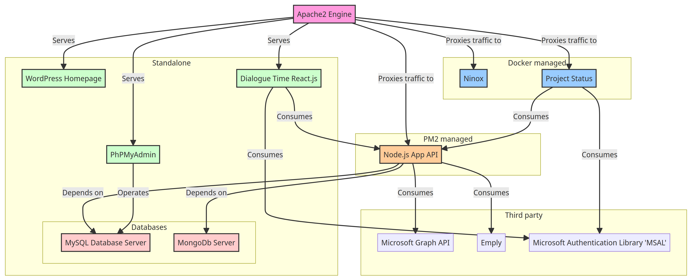

> # Server Architecture

## Introduction

Understanding the dependencies and relationships between services running on a server is crucial for effective management and troubleshooting. Here's a list of services currently running on your server and their dependencies.

### List of Services and Dependencies

#### PM2-Managed Service

1. **Dialogue Time backed (Node.js App)**

   - **Managed By:** PM2
   - **PM2 Service Name:** `api_v_2`
   - **Architecture:** Express server with REST API
   - **Dependencies:**
     - MySQL Database Server
     - MongoDb Server
     - Emply
     - Microsoft Graph API
   - **Proxy:** Apache2

#### Standalone Services

1. **MySQL Database Server**

   - **Managed By:** Standalone on the server
   - **Dependencies:** None

2. **MongoDb Server**

   - **Managed By:** Standalone on the server
   - **Dependencies:** None

3. **Apache2 Engine**

   - **Managed By:** Standalone on the server
   - **Dependencies:** None
   - **Role:** Serves as a proxy for multiple applications

#### Docker-Managed Services

1. **Ninox**

   - **Managed By:** Docker-compose
   - **Dependencies:**
     - Apache2
     - All dependencies managed within the container (e.g., its own database)
   - **Proxy:** Apache2

2. **Project Status**

   - **Managed By:** Docker-compose
   - **Dependencies:**
     - Apache2
     - Dialogue Time backed (Node.js App)
   - **Architecture:** Express server with REST API
   - **Proxy:** Apache2

#### Served by Apache2

1. **WordPress Homepage**

   - **Managed By**: Standalone on the server
   - **Dependencies:** Apache2
   - **Served by**: Apache2

2. **Dialogue Time (React.js Application)**

   - **Managed By**: Standalone on the server
   - **Dependencies:** Apache2
   - **Served by**: Apache2

3. **PhPMyAdmin**

   - **Managed By:** Standalone on the server
   - **Dependencies:** Apache2
   - **Role:** Provides a web interface to manage MySQL databases
   - **Served by:** Apache2

## Server Architecture Diagram

